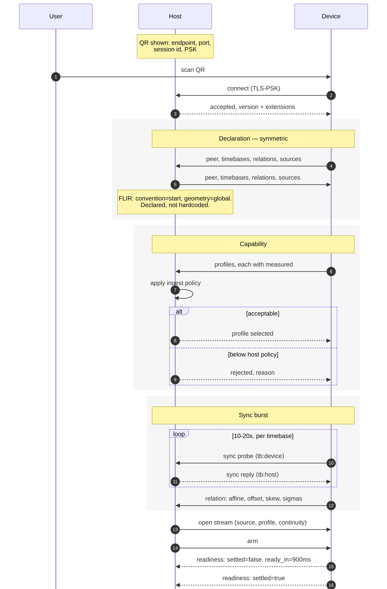
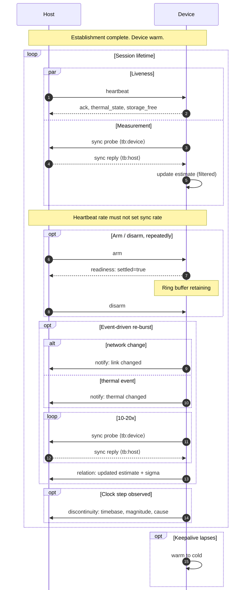
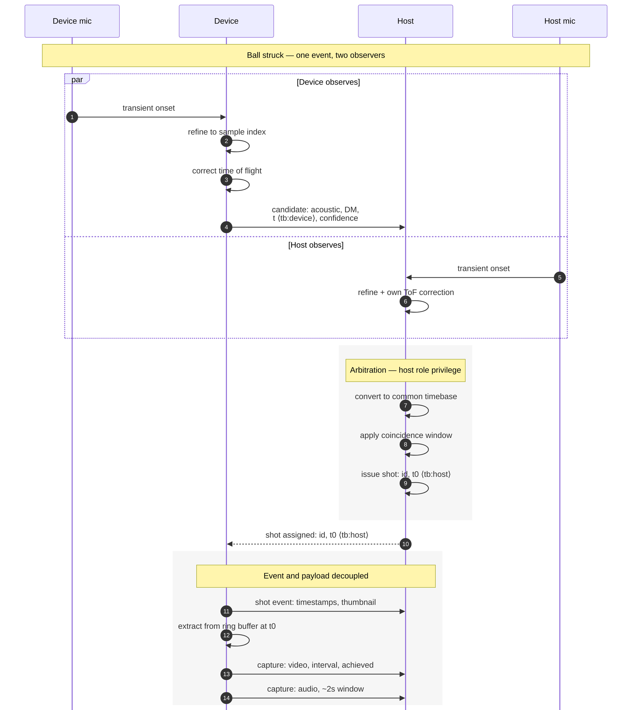
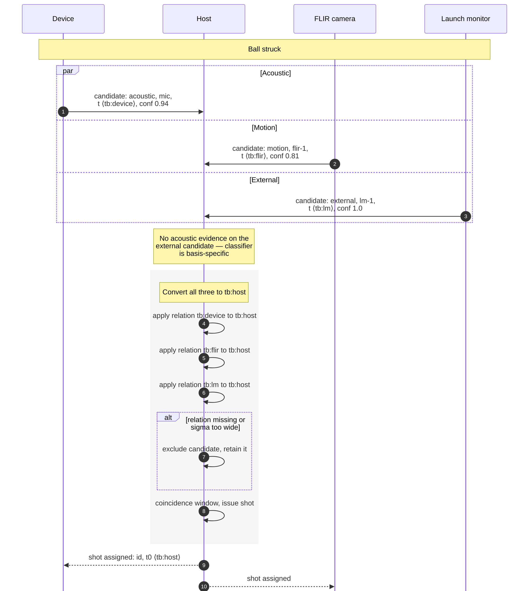
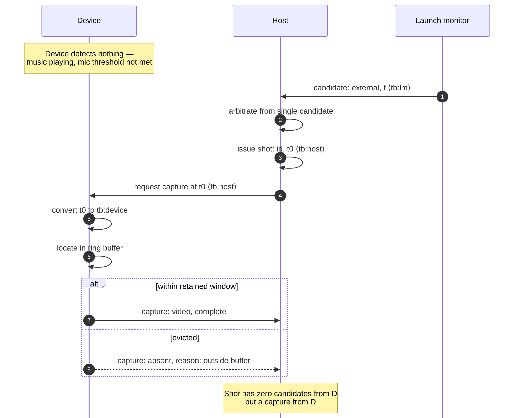
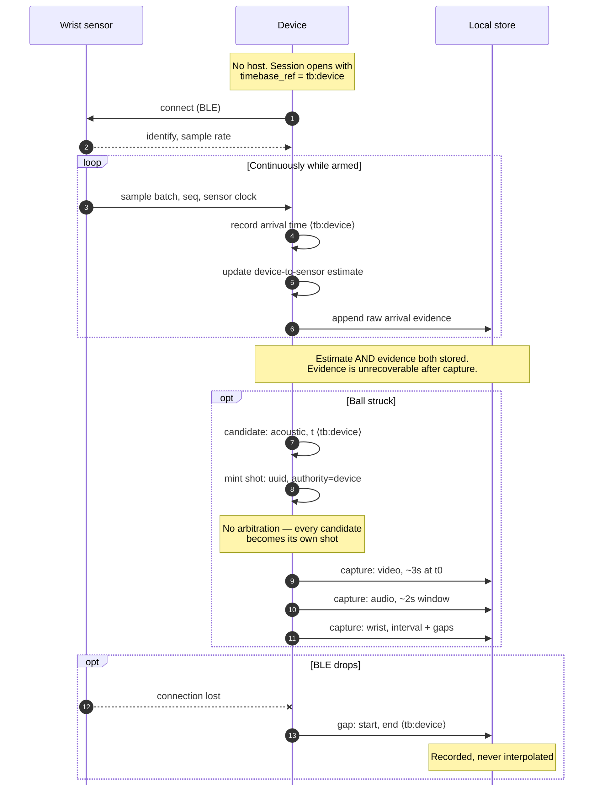
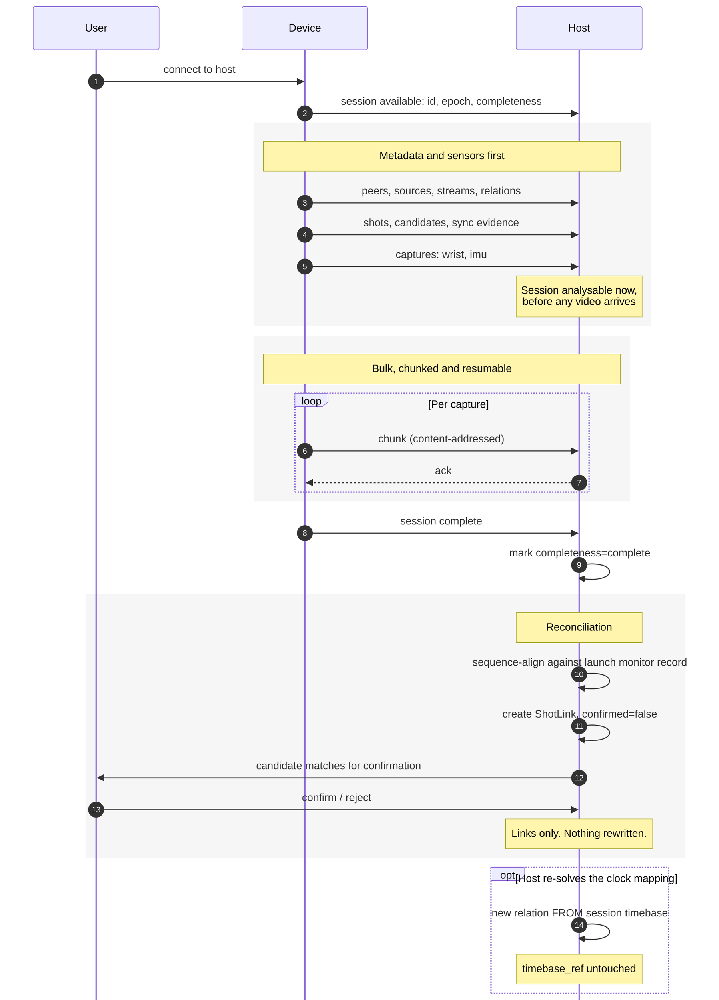
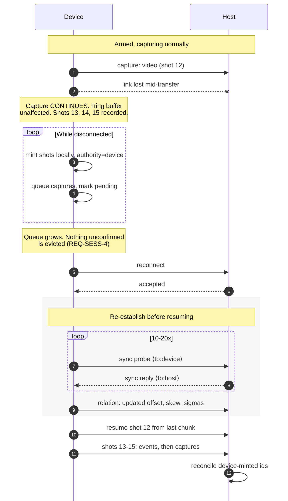
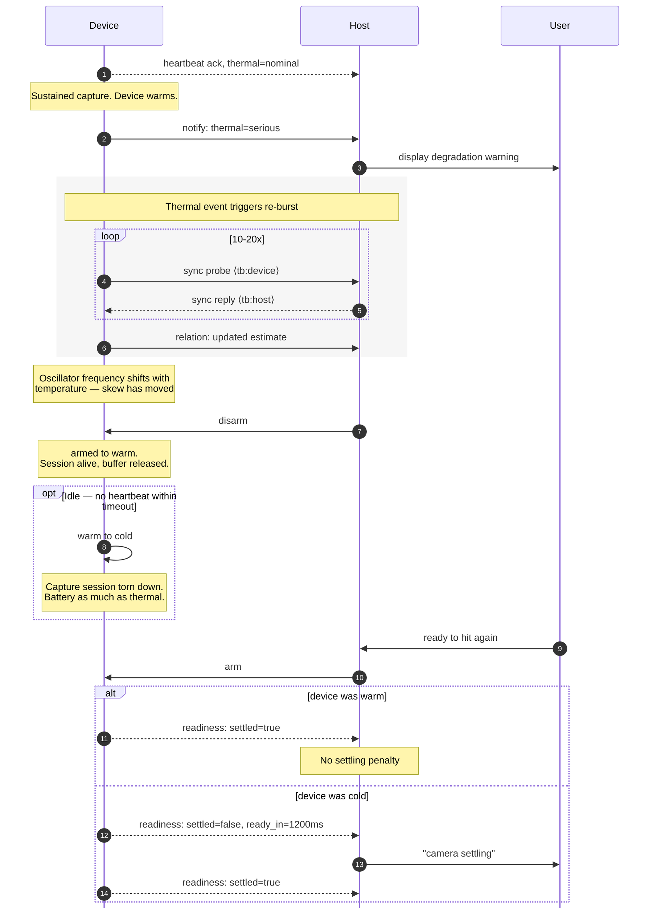

# PPCP — Protocol Overview

**PinPoint Capture Protocol: conceptual model and interaction sequences**

| | |
|---|---|
| Status | For implementation team review |
| Date | 21 August 2026 |
| Version | Model draft 4, sequences complete (9 of 9) |
| Basis | `capture-companion-requirements.md` |
| Repo | `PinPointGolf/libppcp` |
| Next | Message catalogue, wire encoding, normative specification |
| Companion | `PPCP-RV` — rendezvous and pairing, versioned separately (§E.1) |

---

## What this document is, and is not

This is the **protocol overview**: the entities PPCP models, the invariants that constrain them, and the sequences in which peers interact. It is intended to be reviewable in one sitting by an implementation team before anyone writes wire-format code.

It deliberately stops short of the specification. Message names, field encodings, framing and versioning mechanics are the next layer down.

### Normative and illustrative content

The two halves of this document have **different authority**, and conflating them will cause implementation errors:

| Part | Authority | Meaning |
|---|---|---|
| **Part 0 — Assumptions and scope** (§§A–F) | **Normative where marked MUST** | What PPCP assumes of its transport and its peers, which profiles exist, and what is deliberately out of scope. |
| **Part I — Conceptual model** (§§1–10) | **Normative** | Entities, relationships and the twenty-one invariants of §8, which become conformance tests. An implementation that violates one is non-conformant. |
| **Part II — Sequences** (§§11–19) | **Illustrative** | What happens and in what order. **Message names are provisional placeholders.** Where a name here disagrees with the message catalogue, the catalogue wins. |
| **Part III — Implementation guidance** (§§G–J) | **Advisory** | Build order and known conformance traps. Nothing here constrains an implementation. |

Read Part II to understand the protocol's shape. Do not implement its message names.

### Why they are one document

Every fault found in the model so far was found by *using* it — tracing a flow and discovering the model could not express it. Draft 3's Candidate could not express a launch-monitor nomination; draft 4's host/device asymmetry surfaced only when someone asked where the host's timebase lived. Sequences are how a model is tested, and kept in a separate file they drift silently, because nobody diffs a diagram against an entity list.

### Review guidance

- **Start with Part 0.** §A carries a transport requirement (two independent channels) that is easy to miss and expensive to retrofit, and §C tells you which profiles you actually need to implement.
- **If you are reviewing the model**, §§2, 6 and 9 carry nearly all the difficulty. §9 lists where it is known to be weak.
- **If you are reviewing for implementability**, start at Part II and work back to the entities each sequence touches.
- **Traceability tables** under each diagram link steps to requirements in `capture-companion-requirements.md`, so any line can be traced to the requirement that motivated it.

---

# Part 0 — Assumptions, scope and dependencies

*Normative where marked MUST. Read before Part I.*

## A. What PPCP assumes of its transport

PPCP is transport-agnostic (REQ-TRANS-1) but not transport-indifferent. An implementation must supply a transport meeting this contract.

- **A1 (MUST)** Ordered, reliable, bidirectional delivery. PPCP does not retransmit, reorder or checksum.
- **A2 (MUST)** **At least two logically independent channels with independent flow control** — one for control and events, one for bulk payload.
- **A3 (MUST)** Message boundaries, either from the transport or from PPCP framing.
- **A4 (MUST NOT)** PPCP assumes nothing about addressing, discovery or authentication. Those are the locator's concern (REQ-TRANS-2).

### Why A2 is not optional

REQ-SESS-5 requires shot events to arrive immediately while video is permitted to lag. **A single TCP connection cannot satisfy this.** A 25 MB capture in flight head-of-line blocks every subsequent message, including the next shot's event — so a golfer hitting again during a transfer would see the second shot's correlation delayed behind the first shot's video.

Acceptable: two TCP connections; QUIC streams; or application-level multiplexing with interleaving and per-channel windows. Not acceptable: one stream carrying both.

This is a transport *requirement* derived from a protocol requirement, and it is easy to miss because both channels are drawn as one lifeline in Part II.

## B. What PPCP assumes of a peer

Minimum to implement any conformance profile (§C):

- **B1 (MUST)** A monotonic clock with declared resolution, and the ability to timestamp samples **at the source** rather than on receipt.
- **B2 (MUST)** A clock that does not halt across device sleep, or an honest declaration that it does (`epoch_stable: false`) plus discontinuity reporting.
- **B3 (MUST)** Sufficient storage to hold at least one complete shot window for every `shot_windowed` stream it declares.
- **B4 (SHOULD)** Sub-millisecond timestamp resolution. Coarser is expressible — `Timebase.resolution` is declared — but a host will likely reject it under REQ-TIME-3 policy.

Deliberately **not** assumed: a camera, a microphone, a display, a network, a host, or any particular frame rate. A pure `observer` peer satisfies B1–B4 and owns no Sources at all.

## C. Conformance profiles

An implementation need not implement all of PPCP. Requiring that would be hostile to the open-protocol commitment — a video-only offline capture device has no business carrying arbitration logic.

| Profile | Contains | Required invariants |
|---|---|---|
| **Core** | Peer, Timebase, relations, declaration, versioning | I1–I4, I13, I18, I19 |
| **Capture** | Source, Stream, Capture, profiles, arm/disarm, readiness | I5, I10, I11, I12, I17 |
| **Detect** | Candidate nomination with basis and confidence | I6 |
| **Arbitrate** | Shot issuance, coincidence window, canonical t₀ | I7, I8, I20 |
| **Live** | Sync exchange, heartbeat, event/payload split | I3, I21 |
| **Offline** | Bundle read/write, ShotLink, reconciliation | I9, I15, I16 |

**Core is mandatory. Every other profile depends on Core and nothing else.**

Worked examples:

| Implementation | Profiles |
|---|---|
| Offline-only video capture device (v1 PinPointCapture) | Core + Capture + Detect + Offline |
| Full mobile capture device | Core + Capture + Detect + Live + Offline |
| PinPointStudio host | Core + Arbitrate + Live + Offline (+ Capture, owning FLIR sources) |
| Second-screen observer (UC-5) | Core + Live |
| Third-party host with no cameras | Core + Arbitrate + Live + Offline |

A peer declares its profiles at connect. **Arbitrate is available only to `role: host`** (I20).

## D. Transport guidance — wired and wireless

Not normative. The protocol mandates no transport quality, because **uncertainty is declared and acceptance is host policy** (REQ-TIME-3). A WiFi session honestly reporting 2 ms sigma is conformant; whether that is good enough is the host's decision, not the protocol's.

The mechanism worth understanding: minimum-RTT filtering estimates the clock offset from the *shape* of the latency distribution, specifically the tightness of its left tail. That is what determines convergence speed and residual sigma.

| Transport | Left tail | Practical effect |
|---|---|---|
| USB (`usbmuxd` tunnel) | very tight, stable | Fastest convergence, lowest sigma. Best available option. |
| Wired Ethernet host + WiFi device | moderate | Removes host-side variance only. |
| 5 GHz WiFi, host hotspot | moderate, few competing stations | Good. Preferred wireless configuration. |
| 5 GHz WiFi, shared infrastructure | heavy-tailed | More exchanges to converge; higher residual sigma. |
| 2.4 GHz or congested WiFi | very heavy-tailed | Convergence may not reach useful sigma at all. |

Recommendations by use case:

- **UC-2 (occlusion recovery, device beside the host):** prefer USB. The sync quality gain is material and the cable is already within reach. Note the thermal cost — charging while capturing adds heat, so the ability to hold charge off matters.
- **UC-1 and UC-3 (entry-level, range):** WiFi, preferring a host-provided hotspot over shared infrastructure. QR-carried SSID and passphrase driving `NEHotspotConfiguration` removes the network problem rather than working around it (REQ-DISC-4).
- **Any range or public venue:** assume multicast fails. Client isolation, multicast rate limiting and VLAN boundaries are all common. QR pairing is the primary path for this reason (REQ-DISC-2).

Device-side wireless caveats worth designing around: WiFi power-save can inject tens of milliseconds of latency, and Apple's peer-to-peer AWDL shares the radio with infrastructure WiFi, so using both degrades each.

## E. What is out of scope

PPCP deliberately excludes, and a specification that adds any of these has overreached:

| Excluded | Belongs to |
|---|---|
| Pairing, authentication, encryption | **PPCP-RV** — see §E.1 (REQ-AUTH-1/2) |
| Discovery, addressing | **PPCP-RV** — see §E.1 (REQ-DISC-1/2) |
| Byte transfer mechanics, chunking, resumption | Transport (REQ-OFF-9) |
| Ingest thresholds — frame rate, resolution, quality | Host policy (REQ-CAP-5, I14) |
| Pose, fusion, metrics, diagnostics, session assessment | Host pipeline (§2 of the requirements) |
| Device state machine names (`cold`/`warm`/`armed`) | Device-internal (REQ-STATE-6) |
| Detection thresholds and classifier design | Device-internal |
| The archive of sessions across days and devices | Host storage |

### E.1 Rendezvous is a separate specification, not merely local

An earlier draft of this section treated discovery and pairing as local deployment concerns alongside transport. That conflated two things which behave differently.

**Transport is genuinely local.** TCP, a USB tunnel, QUIC — a deployment choice. Two conformant peers that pick different transports simply do not connect over that path, and no interoperability claim is harmed.

**Rendezvous is a mutual agreement problem.** If a third-party host advertises `_swingcap._tcp` while PinPointCapture browses for `_ppcp._tcp`, the two never meet and every invariant downstream is unreachable. A protocol whose peers cannot find one another is open in theory only.

So rendezvous must be specified — but as a **companion specification, `PPCP-RV`**, versioned independently in the same repository. Two reasons for keeping it outside PPCP core: it will version faster (NFC, deep links and BLE pairing will arrive without touching the entity model), and a USB-only peer should not implement mDNS to be conformant.

`PPCP-RV` must fix at minimum:

- **Service type and TXT record contents** — one agreed name, with enough in TXT (protocol version, peer id, role) that a host can filter *before* connecting rather than after.
- **QR payload format.** The highest-priority item, because REQ-DISC-2 makes QR the primary pairing path, not a fallback. It is an opaque fixed blob both sides must parse with no chance to negotiate first, so it needs a version marker in its first field or it can never change.
- **PSK derivation and TLS-PSK identity format**, without which the handshake cannot complete across implementations.
- **Optional SSID and passphrase extension** for the host-hotspot join of REQ-DISC-4.

**`PPCP-RV` is also where the security model belongs.** Part I §9.2 records that PPCP has none, which is defensible only if it lives somewhere — and it currently lives nowhere. PSK strength, replay resistance, whether a peer may rejoin a session after reconnecting without re-pairing, and the `Peer.id` persistence question of §3.1 are all rendezvous concerns. Treating them as delegated rather than absent requires the companion document to exist.

**Conformance:** implementing `PPCP-RV` is **optional**. A peer connecting only over USB, or handed an established socket by an embedding application, is fully PPCP-conformant with no rendezvous implementation at all. This matches `libppcp` taking an already-established byte stream (REQ-TRANS-1) and keeps the core clean.

### E.2 Offline capture

**Offline capture and export are in scope, with a boundary.** The *bundle contents* are a recorded PPCP stream (REQ-OFF-1) and are fully specified — that is §17. *Moving the bytes* is a transport concern, no more part of PPCP than TCP is. One consequence worth stating plainly: an implementation that can parse a live session can parse a bundle, because they are the same messages. That is the point of REQ-OFF-1, and it is a conformance test rather than an aspiration.

## F. Extension and registry policy

`Source.kind`, `Stream.kind` and `Candidate.basis` are open registries (REQ-STREAM-1, I13). For an openly published protocol that raises a question the requirements do not answer: who allocates values, and how does a third party add one without collision?

- **F1 (MUST)** Unknown `kind` and `basis` values are ignored, never fatal (I13).
- **F2 (MUST)** Vendor-defined values are namespaced by a reverse-DNS prefix — `com.example.forceplate` — so third parties may extend without coordination.
- **F3 (SHOULD)** Unprefixed values are reserved for the published registry, maintained in the `libppcp` repository.
- **F4 (SHOULD)** A vendor value that proves generally useful is proposed for the unprefixed registry rather than remaining vendor-scoped indefinitely.

Without F2, the first third party to add a sensor type either collides with a future core value or forks the protocol.

---

# Part I — Conceptual model

*Normative. The twenty-one invariants in §8 are conformance tests.*

## 0. Reading guide

Seven entities. Two of them — **Timebase** and **Shot** — carry nearly all the difficulty. If reviewing time is short, read §2, §6 and §9.

Two design stances, applied throughout:

**The protocol describes what happened; it does not assert what is true.** Devices report, hosts interpret. Wherever a value could be either a measurement or a conclusion, the model carries the measurement. This is why composition was rejected (§2.5), why losing candidates are retained (§6.1), and why readiness is a measurement rather than a state name (§7.1).

**Prefer structural enforcement to stated rules.** Where an invariant can be made unwriteable rather than merely forbidden, do that. Four requirements now live in structure rather than prose: REQ-OPT-5, REQ-OPT-6, REQ-PORT-8, REQ-OFF-12.

---

## 1. Entity overview

```
Peer ──┬── declares ──> Timebase (1..n)
       ├── owns ──────> Source (0..n)
       └── joins ─────> Session
                          │
                          ├── contains ──> Stream (0..n)
                          ├── contains ──> Shot (0..n)
                          └── contains ──> ContextChange (0..n)

Source ─┬── references ──> Timebase
        ├── supports ────> CaptureProfile (1..n)
        └── has ─────────> Calibration (0..1)

Stream ─┬── from ───────> Source           the contract:
        ├── activates ──> CaptureProfile    what is invariant
        └── declares ───> continuity        for the stream's lifetime

Shot ──┬── nominated by ──> Candidate (1..n)   one per nominating source
       └── realises ──────> Capture (0..n)     one per participating Stream
```

Seven entities: **Peer**, **Timebase**, **Source**, **Session**, **Stream**, **Shot**, **Calibration**. Plus subordinate types — **Candidate**, **Capture**, **CaptureProfile** — not independently addressable, and **TimebaseRelation**, **ShotLink** and **ClockDiscontinuity**, which are relations and observations reified.

**Bundle** is deliberately absent. Per REQ-OFF-1 a bundle is a Session serialised, not a distinct entity.

### 1.1 The two-level pattern

The model uses one pattern twice, and it is worth naming because it recurs:

| Level | Entity | Holds |
|---|---|---|
| Contract | **Stream** | what is fixed for the stream's lifetime: source, profile, timebase, continuity |
| Realisation | **Capture** | what happened for one shot: interval, gaps, achieved capability, transfer state |

Same relationship as `CaptureProfile` (declared) to `achieved` (realised). Putting Streams inside Shots would make per-shot profile variation *expressible*, which REQ-OPT-6 forbids — invariants are better enforced by having nowhere to write the violation.

---

## 2. Timebase

The hardest entity, and the one whose shape everything else inherits.

### 2.1 Why it is an entity

REQ-TIME-1 requires every sample to declare its reference timebase *by identity*. That forces timebases to be first-class and addressable rather than an enum. An Android device with `SENSOR_INFO_TIMESTAMP_SOURCE == UNKNOWN` has camera and audio timebases that are genuinely different clocks; an iOS device has one clock serving both. The model must express both without privileging either.

### 2.2 Structure

```
Timebase
  id            local to the declaring peer, stable for the peer's lifetime
  kind          monotonic | continuous | wall
  epoch_stable  bool — does it survive device sleep?
  resolution    nominal tick, ns
  origin        opaque, informational (e.g. "CMClockGetHostTimeClock")
```

`kind` is deliberately coarse. `monotonic` halts across sleep, `continuous` does not (REQ-TIME-4), `wall` is subject to jumps and is label-only (REQ-OFF-8).

### 2.3 Identity is shared id, not a relation class

Since a Source *references* a timebase id (§4), two sources on the same clock reference **the same id**. Identity is expressed structurally.

- **iOS:** camera Source and microphone Source both reference `tb:hosttime`. No relation exists because none is needed.
- **Android, `TIMESTAMP_SOURCE == UNKNOWN`:** camera and microphone reference *different* ids. A relation is therefore structurally required, and its absence is a detectable error rather than a silent assumption of zero.

**REQ-PORT-8 is enforced by the model rather than by prose.** A port that assumes camera and mic share a timebase must either declare one id (a checkable claim) or declare two and supply a relation. There is no third option and no silent default.

### 2.4 Relations

```
TimebaseRelation
  from, to      timebase ids
  class         affine | unrelated
  offset        ns            (affine only)
  skew          ppm           (affine only)
  offset_sigma  ns            (affine only)
  skew_sigma    ppm           (affine only)
  method        declared | measured | estimated_online
  observed_at   timestamp in `from`
  evidence_ref  optional stream id carrying raw evidence
```

**`unrelated` is a legal, complete declaration.** An honest Android `UNKNOWN` device declares `unrelated` and remains a valid peer. The host applies REQ-TIME-3 policy and may refuse it. The alternative — a fabricated offset — is the failure mode the contract exists to prevent.

**Uncertainty is mandatory on `affine`.** No `offset` without `offset_sigma`. A point estimate with no dispersion is what silently corrupts fusion, and optional sigma is omitted sigma.

`method` distinguishes a vendor-documented constant from a one-off measurement from a live estimate. These age very differently.

### 2.5 No composition — closed

**Relations are directed and never composed.** If A→B and B→C are both `affine`, A→C is not derived. A peer needing A→C measures and declares it directly.

Two reasons, the second decisive:

**Composition is interpretation.** Publishing a composed relation would let a device emit a conclusion, against the stance in §0. Composed sigmas are also optimistic unless correlation is carried, and the model does not carry it.

**The motivating case dissolves.** Draft 2's example was a device with camera→system and audio→system, unable to express camera→audio. But on Android under `TIMESTAMP_SOURCE == UNKNOWN`, camera→system is *precisely the relation that does not exist* — that is what `UNKNOWN` means. Composition is therefore unavailable in the exact case REQ-PORT-8 cares about, and a genuinely multi-clock device must measure camera↔audio directly regardless.

#### 2.5.1 The replacement obligation

One composition case survives the argument above and must be handled explicitly, or implementers will compose silently.

Network clock sync (REQ-SYNC-1) runs on whichever timebase the network stack timestamps on — call it `tb:B`. If the camera is on `tb:A`, the host needs A→host, which is A→B composed with B→host.

**Obligation:** a multi-clock peer runs the sync exchange **per timebase** and declares each relation directly. More work for the peer; no correlated-sigma problem; consistent with carrying the measurement rather than the conclusion.

**This is a peer obligation, not a device obligation** — corrected in draft 4. A host with several FLIR cameras, each on its own clock, is itself multi-clock and carries the same duty toward every other peer in the session. Draft 3 wrote it as something devices owe hosts, which is the phone-first reading the model must not have.

*Stated here rather than deferred to the message catalogue — a call taken, reversible.*

### 2.6 One relation type, three uses

Device↔host network sync (REQ-SYNC-1), device↔BLE-sensor offline (REQ-OFF-4), and camera↔microphone on Android (REQ-PORT-8) all produce the same structure, differing only in `method`.

### 2.7 Clock discontinuity — new in draft 3

`epoch_stable` declares whether a clock *should* survive sleep. REQ-TIME-4's second clause — discontinuities are detected and reported — needs somewhere to land, and by §0's stance an observed step is a measurement, not an absence.

```
ClockDiscontinuity
  timebase_id
  observed_at     timestamp in a reference timebase that did not step
  magnitude       ns, signed
  cause           sleep | ntp_correction | manual | timezone | unknown
```

This is the only record a device writes about **its own clock, mid-session**, which makes it a small but distinct category.

It also gives I15 its evidence: a wall-clock jump is precisely the proof that an interval computed from wall clock would have been wrong.

---

## 3. Peer

```
Peer
  id            stable across sessions and reconnects
  role          host | capture | observer
  timebases     Timebase[]
  relations     TimebaseRelation[]
  discontinuities ClockDiscontinuity[]
  sources       Source[]
  protocol      version + extension set
```

**`role` is per-session, not intrinsic.** A device is `capture` in one session and could be `observer` in another. Roles are capabilities-in-context, not device types.

**`observer` exists** for the second-screen case (UC-5): a peer that receives but contributes no streams.

**At most one `host` per session** — corrected in draft 4. Draft 3 said *exactly* one, which contradicted REQ-SESS-2 (sessions exist without a host) and REQ-OFF-4/5 (offline, the device is time authority). Multi-host remains unmodelled; offline peer-to-peer (UC-6, REQ-OFF-16) is two independent sessions reconciled at import — see §9.1.

| Hosts | `Session.timebase_ref` | `Shot.authority` | Arbitration |
|---|---|---|---|
| 0 | a device timebase | `device` | **none occurs** (§6.3) |
| 1 | the host's timebase | `host` | host arbitrates |

**Peer is not a synonym for device.** A host is a Peer with `role: host`; it declares Timebases and owns Sources exactly as a phone does. A FLIR camera is a Source with `kind: camera`, its own `timebase_id`, its own profiles and its own calibration. Every structure in §2 and §4 applies to both sides without exception — see §4.6.

Capability lives entirely below Peer: claimed and measured on CaptureProfile, achieved on Capture.

### 3.1 Peer identity vs. installation identity

`Peer.id` must survive app reinstall for offline reconciliation, but must not be a platform device identifier that privacy rules forbid. Modelled as a generated UUID persisted in the app's own store, with the consequence that reinstall creates a new peer and old bundles carry the old id. The host reconciles on session, not peer.

---

## 4. Source

The physical capture source: a camera, a microphone, an IMU, a relayed BLE sensor, an external launch monitor.

```
Source
  id
  peer_id       the owning peer (REQ-STREAM-3 — negotiable)
  kind          camera | microphone | imu | wrist | launch_monitor | ...
  timebase_id   which clock its samples are in
  profiles      CaptureProfile[]     supported, each carrying its own measured results
  calibration   Calibration          optional
  physical      bool                 REQ-OPT-5
```

### 4.1 Why the layer exists

A phone Peer has a camera and a microphone with *different* calibrations, *different* profile sets and potentially *different* timebases. Only one of those can hang off the Peer. Draft 1 smeared these across Peer and Stream, and calibration fell through the gap entirely.

### 4.2 What it resolves

**Calibration unifies.** Three concepts in the requirements doc turn out to be one:

| Source kind | Calibration is |
|---|---|
| camera | intrinsics, distortion, extrinsics |
| microphone | position — which *is* the acoustic time-of-flight constant (REQ-MIC-3/4) |
| imu / wrist | bias, alignment |
| launch_monitor | position and orientation relative to the rig |

All are the mapping from a Source to the physical world, all estimated the same way, all carrying uncertainty.

**REQ-OPT-5 becomes structural.** `physical: bool` distinguishes a real capture device from a virtual multi-lens device that silently swaps sensors mid-session.

**Ownership negotiation is clean.** REQ-STREAM-3's wrist sensor is the same Source whether the phone or the host holds the BLE connection; only `peer_id` differs.

**`launch_monitor` is a Source kind.** This is the call taken in §6.1: rather than making `Candidate.source_id` optional for non-acoustic nominators, a launch monitor is modelled as a Source — it has a clock, a calibration and an owning peer, which is exactly what a Source is. It falls out of the open `kind` registry with no new machinery, and it keeps `source_id` mandatory, which matters because an optional `source_id` would strand a Candidate with no calibration to apply.

### 4.3 CaptureProfile

```
CaptureProfile
  id
  format        codec, resolution, pixel format
  rate          nominal, and achievable range
  optical       exposure range, iso range, noise figure   [camera only]
  geometry      rolling_shutter { readout_ns, direction } | global
  timing        { convention: mid | start | end | nominal_frame_start }
  intrinsics    per_frame | fixed | none
  measured      MeasuredCapability                        (REQ-CAP-2)
```

**`measured` is per-profile, not per-source** — corrected in draft 3. "This camera measured X" is incoherent in the same way "this peer supports these profiles" was: 1080p240 and 1080p120 are separate self-tests with separate results, and REQ-CAP-2 requires re-measurement after OS updates. Draft 2 caught the category error at one boundary and reproduced it at the next.

**No frame-rate threshold appears anywhere in the model** (REQ-CAP-5). A profile declares 60 fps as readily as 240. Acceptance is host policy expressed outside the protocol.

**`geometry` is per-profile, not per-source**, because a source may expose both a global-shutter and a rolling-shutter mode, and readout time differs per mode (REQ-EXP-3).

### 4.4 Calibration

```
Calibration
  id
  source_id
  kind          intrinsics | position | bias_alignment | pose
  parameters    kind-specific
  uncertainty
  method        factory | per_frame | solved | user_measured | estimated_online
  observed_at
```

Fixed for the lifetime of any Stream that references its Source (§5, I5). A calibration change closes the Stream and opens a new one within the same Session.

### 4.5 Exposure convention — new in draft 3

The gap the review identified first, and the one that blocks correctness rather than expressiveness. Draft 2 carried REQ-EXP-3's readout time in `geometry` but had nowhere for REQ-EXP-1/2 — the canonical mid-exposure instant, and the device's declaration of its native convention.

Without it, the cost is stated in the requirements doc: an exposure-dependent systematic offset indistinguishable from clock bias, which then corrupts the host's bias estimator.

**The conversion contract spans two entities and must be stated explicitly**, or two implementers will place the correction differently and both believe themselves compliant:

> The canonical instant of a frame is **mid-exposure**. Given a sample timestamped `t` on a Stream whose profile declares `timing.convention`, and an exposure duration `d` taken from that frame's entry in `Capture.achieved`:
>
> - `mid` → canonical is `t`
> - `start` → canonical is `t + d/2`
> - `end` → canonical is `t − d/2`
> - `nominal_frame_start` → canonical is `t + d/2`, and the profile must additionally declare any fixed offset between nominal frame start and actual exposure start
>
> For rolling-shutter profiles this yields the canonical instant **of the first row**. The instant for row *r* of *R* is that value plus `readout_ns × r/R`, in the declared `direction`.

`convention` is a property of the profile; `d` is per-frame and lives in `achieved`. The split is deliberate — exposure varies frame to frame under any auto mode, and REQ-OPT-3 locks exposure precisely so this correction is stable, but the model must not assume the lock held.

### 4.6 Declaration is symmetric — new in draft 4

Every field in §4.3 is declared by **both** sides. This is not a new requirement; it is a statement that the existing structure applies without exception, which draft 3's phone-centric examples obscured.

| Declared by a phone Source | Declared by a host Source |
|---|---|
| `timing.convention: nominal_frame_start` (AVFoundation) | `timing.convention: start` (FLIR) |
| `geometry: rolling_shutter { readout_ns, direction }` | `geometry: global` |
| `intrinsics: per_frame` | `intrinsics: fixed` |
| `measured` per profile | `measured` per profile |
| `calibration` | `calibration` |

**Why this matters more than it looks.** REQ-EXP-2 exists precisely because FLIR timestamps start-of-exposure while AVFoundation reports nominal frame start — a mismatch producing a bias indistinguishable from clock error. The §4.5 conversion resolves it *only if both conventions are on the wire*.

If only devices declare, a host must hardcode its own cameras' convention. That works for PinPointStudio and fails the open-protocol commitment immediately: a third-party host with different cameras cannot participate, because the conversion has been baked into one implementation instead of carried by the protocol.

**Corollary.** A host that owns no capture Sources — a pure receiver, as in a phone-only session with a laptop attached — declares no profiles and still participates fully. Source count is not a role marker.

---

## 5. Stream

The **contract**: what is invariant for the stream's lifetime.

```
Stream
  id, session_id
  source_id
  kind          video | audio | imu | wrist | event | metadata
  profile_id    activated from the source's supported set
  continuity    continuous | shot_windowed
  timebase_id   inherited from source, restated for locality
  opened_at, closed_at
```

**Stream lifetime, not session lifetime** — corrected in draft 3. Draft 2 said "invariant for the session", which created a phantom problem: a knocked tripod appearing to end the session. It does not. A Session contains `Stream[]`, so a calibration or profile change closes one Stream and opens another *within* the same Session, and Captures partition naturally by `stream_id`.

A useful consequence: which shots share a calibration reads straight off the data.

`kind` is an open registry, not a closed enum (REQ-STREAM-1).

### 5.1 Continuity

Streams differ in whether they are continuous or shot-windowed, and the distinction is load-bearing because **it changes what absence means**:

| Continuity | Absence between shots means |
|---|---|
| `shot_windowed` | correct and expected — nothing needed recording |
| `continuous` | a dropout, recorded as an explicit gap (REQ-OFF-13) |

Without the flag a host cannot distinguish the two, which is exactly the failure REQ-OFF-13 exists to prevent.

| Stream kind | Continuity |
|---|---|
| video | always `shot_windowed` — the ring buffer discards everything else; the continuous stream is never materialised |
| audio | `shot_windowed`, windowed on **Candidate** rather than Shot (§6.2) — **OPEN-2 resolved** |
| imu, wrist | either — continuous while armed, or windowed per shot |
| event, metadata | always `continuous` |

---

## 6. Shot

The second hard entity, because REQ-SHOT-1 through 4 describe a distributed agreement problem and state the policy without the mechanism.

### 6.1 Candidate and Shot are different things

```
Candidate                            Shot
  peer_id                              id          canonical, host-issued or device-minted
  source_id     mandatory              t0          canonical instant
  basis         acoustic | motion      timebase_id which clock t0 is in
                | external             authority   host | device
  timestamp     in source's tb         candidates  Candidate[]   all of them, always
  confidence    0..1                   captures    Capture[]
  classifier    basis-specific
  evidence      optional stream ref
```

**`basis` is new in draft 3.** Draft 2 had quietly narrowed Candidate to acoustic: `source_id` was annotated "which microphone" and `classifier` was a transient taxonomy (`impact | screen | mat | unknown`). But REQ-SHOT-1 admits FLIR-side motion detection and launch monitors, neither of which is acoustic. As drafted, a launch-monitor nomination could not be expressed without violating I6.

`classifier` is now **basis-specific**: the transient taxonomy applies to `acoustic` and is meaningless for `external`.

**`source_id` stays mandatory.** A launch monitor is a Source (§4.2), so it has one. An optional `source_id` would strand a Candidate with no calibration to apply — and calibration is where acoustic time-of-flight lives (REQ-MIC-3).

A Shot **always retains every Candidate**, including losers, including ones from peers whose clocks later proved badly offset. Arbitration is a conclusion; candidates are the evidence. A host may re-derive `t0` later with a better clock estimate.

### 6.2 Candidate evidence — OPEN-2 resolved

`Candidate.evidence` was vague in drafts 1 and 2. It is now defined, and its definition settles the audio retention question.

**Resolution: audio is retained in short windows attached to Candidates, not to Shots, and not as a continuous track.**

The reasoning is diagnostic rather than verificational. The value of retained audio is explaining **why detection fired** — including when it fired wrongly: a noise in the bay, a shot in the next bay, a phone notification, music. That means the audio must survive for candidates that *lost or were rejected*, and a rejected candidate has no Shot. So the window hangs off Candidate.

This also connects to I8: candidates are never discarded, and now neither is the evidence explaining them.

Three consequences the model carries:

- **Audio is a separate Stream from video, with its own shorter window.** Muxing audio into the video clip would retain ~4.5 s of room audio per shot when the diagnostic need is ~1.5–2 s centred on the transient — a privacy cost taken by accident, for no benefit.
- **Order of magnitude:** ~50 candidates × ~2 s ≈ 100 s per session, non-contiguous, each fragment centred on a transient. Speech capture is incidental rather than systematic. That distinction is what REQ-PRIV-2 must state honestly.
- **Raw PCM at v1.** A derived representation (band energy, spectrogram) would have a better privacy posture, but forecloses re-running an improved classifier on original audio — a real loss while the detector is immature. Derived form is a candidate default once the classifier settles.

**Sub-threshold retention is out of scope for the protocol.** Retaining audio for near-miss candidates would help diagnose false *negatives*, but that is detector tuning policy, and the protocol encodes thresholds no more than it encodes frame-rate floors (REQ-CAP-5). A device may already emit low-confidence candidates — `confidence` is a float and nothing forbids 0.2. Where this belongs is a device diagnostic mode under REQ-OBS-1, off by default.

### 6.3 Arbitration

**Arbitration is a role privilege of `host`.** With no host in the session there is no arbitration: every Candidate becomes its own Shot with `authority: device`, and any later agreement between sessions happens through `ShotLink` (§6.4) at import.

This is worth stating rather than inferring. "No arbitration" is a materially different regime from "arbitration with a single nominator" — an offline device implementing the latter would apply a coincidence window and collapse distinct candidates, producing subtly different output from the same acoustic evidence.

The requirements say the host arbitrates; they do not say how. Three cases the doc does not cover:

**Coincidence window.** Two candidates are the same shot if their timestamps, *converted into a common timebase using current relations and the exposure convention of §4.5*, fall within a window. Proposed as a declared session parameter rather than a constant, because acoustic time-of-flight spread (REQ-MIC-3) sets its floor and that is rig-dependent. Default proposal: 50 ms.

**Late candidates.** A candidate arriving after arbitration attaches to the existing Shot; `t0` is **not** revised. Revision would invalidate captures already extracted against it. The candidate is retained (§6.1) so a host may re-derive offline.

**Orphan requests.** REQ-SHOT-2 requires a device to serve a clip for a `t0` it never detected. That is a Shot with zero candidates *from that peer* — legal, and why `candidates` is not `1..n` per peer.

### 6.4 Device-minted shots and reconciliation

REQ-SHOT-3: offline, `authority: device` and the id is device-generated. On import the host may match it to an existing Shot.

**Reconciliation produces a link, not a merge** (REQ-OFF-12):

```
ShotLink
  local_shot_id, foreign_shot_id
  basis        interval_alignment | acoustic_correlation | manual
  confidence
  confirmed    bool
```

Unconfirmed links are visible and reversible; nothing is rewritten. There is no merge operation in the model to invoke by accident.

### 6.5 Capture

The **realisation**.

```
Capture
  shot_id, stream_id
  interval      [start, end] in the stream's timebase
  completeness  complete | partial | absent
  gaps          Interval[]                    (REQ-OFF-13)
  achieved      AchievedCapability            (REQ-CAP-3, incl. per-frame exposure — §4.5)
  transfer      pending | in_flight | present | failed
```

Named Capture rather than Segment because for video the continuous stream is *never materialised* — only the ~3 s clips are written, so "segment of a stream" described a fiction. "Segment" also collides with HLS/DASH terminology.

**`completeness` and `transfer` are separate axes.** A Capture can be `complete` + `pending` (captured fine, not yet sent) or `partial` + `present` (arrived intact, sensor dropped mid-swing). REQ-OFF-11 needs the first; REQ-OFF-13 needs the second.

**`achieved` lives here, not on Source or Profile**, because it is a property of *this capture* — realised frame intervals, drops, thermal state, and the per-frame exposure durations the §4.5 conversion depends on.

**`gaps` are never interpolated across**, and are only meaningful on `continuous` streams (§5.1).

---

## 7. Session

```
Session
  id
  peers         Peer[] with roles
  streams       Stream[]
  timebase_ref  canonical timebase — IMMUTABLE once set
  epoch         wall-clock label (REQ-OFF-8 — label only)
  shots         Shot[]
  contexts      ContextChange[]   club, shot type
  state         open | closed
  completeness  explicit (REQ-OFF-11)
```

**`timebase_ref` is explicit rather than implied.** Online it is a host timebase; offline it is the capturing device's (REQ-OFF-4/5 — authority inverts). Making it a field means the offline case is the same structure with a different value, not a special mode.

**`timebase_ref` is immutable — new in draft 3.** An offline session imports with the device's timebase as canonical. REQ-OFF-7 permits the host to re-solve the clock mapping, and if `timebase_ref` were mutable that re-solve would become a rewrite — against the logic of I9. The clean form: the host expresses its better estimate as a new `TimebaseRelation` *from* the session's canonical timebase, leaving the original untouched.

**`contexts` are timestamped changes, not per-shot attributes.** "7-iron from shot 12" is one record, not twelve. This matters for voice tagging (v2), where the tag arrives between shots.

### 7.1 Readiness is a measurement, not a state name

The device state machine (cold/warm/armed) stays out of the protocol — but draft 2's replacement, a readiness enum, was too coarse.

What a host actually needs is not "warm" but *"if I arm now, will the first shot have settled exposure?"* — which is a measurement:

```
Readiness
  settled           bool
  estimated_ready   ms
```

Exporting cold/warm/armed would export an iOS-shaped concept whose settling costs differ on Android — REQ-PORT-* territory. A measurement is portable and answers the actual question. Consistent with §0.

---

## 8. Invariants

Stated so the conformance suite can test them.

**I1.** Every timestamp carries a `timebase_id`. There is no default timebase. *(REQ-TIME-1)*

**I2.** No sample's time is derivable from its index. Sequence numbers, where present, are for loss detection only. *(REQ-TIME-5)*

**I3.** Every `TimebaseRelation` is `affine` or `unrelated`; `affine` without both sigma fields is malformed. *(REQ-TIME-2)*

**I4.** Two Sources on the same clock share a timebase id. Identity is never asserted by relation. *(§2.3, REQ-PORT-8)*

**I5.** A Stream's source, profile, timebase and calibration are fixed for **the stream's** lifetime. A change closes the Stream and opens another within the same Session. *(REQ-OPT-6, §5)*

**I6.** Every Shot has ≥1 Candidate somewhere in the session; a Shot may have 0 candidates from any given peer. *(REQ-SHOT-2)*

**I7.** `t0` is never revised after arbitration. *(§6.3)*

**I8.** Candidates are never discarded, including losers, and neither is their evidence. *(§6.1, §6.2)*

**I9.** Reconciliation creates links; no entity is rewritten or merged. *(REQ-OFF-12)*

**I10.** `completeness` is asserted, never inferred from arrival. *(REQ-OFF-11)*

**I11.** Gaps are explicit, never spanned, and meaningful only on `continuous` streams. *(REQ-OFF-13, §5.1)*

**I12.** A Session is valid with any subset of streams, including video-only. *(REQ-OFF-14)*

**I13.** Unknown fields, unknown `kind` values, unknown `basis` values and unknown profile fields are ignored, never fatal. *(REQ-VER-2)*

**I14.** No frame-rate, resolution, quality or confidence threshold appears in the model. *(REQ-CAP-5, §6.2)*

**I15.** Wall-clock values are never used to compute an interval. *(REQ-OFF-8)*

**I16.** `Session.timebase_ref` is immutable. A host's improved estimate is a new relation, never a rewrite. *(§7, REQ-OFF-7)*

**I17.** Converting a sample to canonical mid-exposure requires both the profile's `timing.convention` and that frame's exposure duration from `achieved`. Neither alone is sufficient. *(§4.5, REQ-EXP-1/2)*

**I18.** `TimebaseRelation` is never composed. A needed relation is measured and declared directly. *(§2.5)*

**I19.** Every Source declares `timing.convention`, `geometry` and `intrinsics` regardless of which peer owns it. No convention is implied by peer role or platform. *(§4.6, REQ-EXP-2)*

**I20.** A Session has at most one peer with `role: host`. With none, `authority` is `device` and no arbitration occurs. *(§3, §6.3, REQ-SESS-2)*

**I21.** The per-timebase sync obligation binds every multi-clock peer, hosts included. *(§2.5.1)*

---

## 9. Where this is weakest

Reduced from seven items to four. §9.1 (candidate over-modelling), §9.2 (composition), §9.3 (device state) and §9.6 (calibration) from draft 2 are closed.

On §9.1 specifically: the over-modelling worry assumed launch monitors were post-v1. They are not — PinPointStudio already has a fully-specified screen for launch-monitor shot ingestion with evidence rows and explicit no-auto-merge. Multi-nominator arbitration is v1 regardless of UC-6, and draft 3's `basis` field is what makes it expressible.

### 9.1 Offline peer-to-peer as two sessions

Two offline devices are modelled as two Sessions reconciled at import (§3). Simple, and needs no hostless mode. But acoustic cross-correlation (REQ-OFF-16) then happens *between* Sessions, while `ShotLink` links shots within an import operation. Whether that generalises to session-level linking is untested.

### 9.2 No security model

Pairing and TLS-PSK (REQ-AUTH-1/2) are transport concerns, deliberately excluded. But `Peer.id` persistence (§3.1) has a privacy dimension, and whether a peer may rejoin a session after reconnecting without re-pairing is a modelling question left unanswered.

### 9.3 Source ownership transfer mid-session

REQ-STREAM-3 negotiates sensor ownership at session start. The model does not say whether ownership can move afterwards — relevant if the host disconnects mid-session and the phone should take over the wrist sensor rather than lose it. Probably wants to be legal; currently unspecified.

### 9.4 Two calls taken rather than deferred

Both are reversible and neither has been tested against the message catalogue:

- **Launch monitor as a Source `kind`** (§4.2, §6.1) rather than making `Candidate.source_id` optional. The alternative is defensible if launch monitors turn out not to have a stable clock or calibration worth modelling.
- **Per-timebase sync obligation stated in the model** (§2.5.1) rather than deferred to the message catalogue. It is arguably a protocol behaviour rather than a structural fact, and may sit better one layer down.

---

## 10. What this unblocks

Nothing remains blocking. The message catalogue can proceed: every entity needs declare/update/query messages, every state transition needs a trigger, and the eighteen invariants become conformance tests.

Two things to carry forward into that work rather than resolve first:

- The exposure conversion contract (§4.5) is prose in a conceptual model and needs to become normative text with worked examples, since it spans two entities and is the most likely place for silent non-conformance.
- §9.4's two calls should be re-examined once the message catalogue exists, when their cost will be visible.

A note on conformance: I19 and I20 are the two invariants a PinPointStudio-only implementation is most likely to satisfy by accident rather than by design — the host's conventions being correct because they are hardcoded, and the zero-host path never being exercised. Both need explicit tests with a non-PinPoint host and a hostless session.

---

# Part II — Interaction sequences

*Illustrative. Message names are provisional; the message catalogue is authoritative.*

## Conventions

- **Participants** are Peers and Sources. A Source appears as its own participant only where its clock or its timing matters.
- **`⟨tb:x⟩`** marks which timebase a value is expressed in. Every timestamp shows one (I1).
- **Dashed arrows** are responses; solid are requests or unsolicited events.
- **Traceability lives in a table below each diagram**, not in notes on it. Notes carry only what the arrows cannot show.

### Rendering

Each diagram carries an `%%{init}%%` block setting `useMaxWidth: false`. By default Mermaid scales the SVG down to fit its container, which shrinks the text; disabling it renders at natural size and lets the container scroll. Font sizes and actor spacing are set in the same block, which is identical across all nine diagrams and can be sed-replaced to restyle globally.

GitHub honours these directives. If a diagram renders small anyway, that renderer is overriding `useMaxWidth` — VS Code preview and mermaid.live differ here. The source is unaffected.

### The nine sequences

| # | Sequence | Principally exercises |
|---|---|---|
| 11 | Session establishment | symmetric declaration, capability, sync burst |
| 12 | Steady state | heartbeat vs sync, arm/disarm cycling, discontinuity |
| 13 | Shot with host present | arbitration, time-of-flight, event/payload split |
| 14 | Shot with an external nominator | `basis`, three timebases, exclusion with retention |
| 15 | Orphan clip request | serving a shot the device never detected |
| 16 | Offline capture | zero-host regime, device as time authority |
| 17 | Offline export | bundle as file transport, reconciliation by link |
| 18 | Degradation | capture degrades last, queue and resume |
| 19 | Thermal lapse and re-arm | why warm exists, readiness as measurement |

## 11. Session establishment

One-shot. Covers REQ-DISC-2, REQ-AUTH-1, REQ-TIME-1/2, REQ-CAP-1/2, REQ-EXP-2a, REQ-SYNC-2, REQ-STATE-6.

Note that **both** peers declare timebases and sources. The host is not a special case — I19, I20.



### Traceability

| Step | Requirement | Note |
|---|---|---|
| 1–3 | REQ-DISC-2, REQ-AUTH-1 | QR is the primary pairing path, not a fallback. PSK feeds TLS-PSK. |
| 5 | REQ-TIME-1/2, I4 | iOS camera and mic share `tb:hosttime`, so no relation is needed. Android `UNKNOWN` declares distinct ids, so a relation is structurally required. |
| 6 | REQ-EXP-2a, I19 | The host declares its own conventions. Omitting this works for PinPointStudio and breaks any third-party host. |
| 8 | REQ-CAP-1/2 | `measured` is per profile — 1080p120 and 1080p240 are separate self-tests. |
| 9 | REQ-CAP-5, I14 | Frame-rate thresholds are host policy, never protocol. |
| 13–16 | REQ-SYNC-2, REQ-SYNC-1a, I3 | Burst estimates rate as well as offset. Sigma is mandatory on `affine`. Per timebase, not per peer. |
| 17 | I5 | Stream fixes source, profile, timebase and calibration for the stream's lifetime. |
| 19–20 | REQ-STATE-6 | Readiness is a measurement. `cold`/`warm`/`armed` never crosses the wire. |

**Worth noticing:** the host declares its sources in step 6 with the same structure the device used in step 5. Draft 3 of the model read as though only devices declared, which would let a host hardcode FLIR's start-of-exposure convention and still appear to work — until a third-party host with different cameras tried to join.

---

## 12. Steady state — capture control, heartbeat, clock maintenance

The session's whole life after establishment. Covers REQ-SYNC-2/3, REQ-STATE-1/3/4, REQ-RES-3.

Three separate concerns share this channel and must not be conflated: **liveness** (heartbeat), **measurement** (sync), and **control** (arm/disarm).



### Traceability

| Step | Requirement | Note |
|---|---|---|
| 2–3 | REQ-STATE-3, REQ-RES-3 | Thermal state is a first-class field so the host reports degradation rather than silently producing worse data. |
| 4–6 | REQ-SYNC-2/3 | Drawn as `par` deliberately: liveness and measurement are separate concerns sharing a channel. One exchange per heartbeat converges far too slowly on skew. |
| 6 | REQ-SYNC-3 | Filtered, never stepped. A stepped offset leaves a discontinuity in fused output that is very hard to diagnose later. |
| 7 | REQ-SYNC-2 | At 20 ppm a full 150 fps frame slips every ~5.5 min, so skew estimation is mandatory. |
| 8–11 | REQ-STATE-1/4 | Host-controlled, never app-controlled. Armed + reviewing is the normal range state, so arm/disarm cycles *inside* the maintained connection. |
| 12–19 | REQ-SYNC-2 | Burst on network change and thermal event, then settle back to heartbeat cadence. |
| 20 | REQ-TIME-4, I15 | An observed step is a measurement, not an absence — and the evidence that any wall-derived interval across it would be wrong. |
| 22 | REQ-STATE-3 | Battery mechanism as much as thermal. Session teardown, not session end. |

**Worth noticing:** heartbeat and sync are drawn as parallel concerns rather than one arrow. Combining them would encode precisely the mistake REQ-SYNC-2 warns against — one exchange per heartbeat gives very slow convergence on skew, and at 20 ppm you slip a full 150 fps frame every ~5.5 minutes.

---

## 13. Shot with host present

Covers REQ-SHOT-1/4/5, REQ-MIC-2/3, REQ-SESS-5, REQ-PRIV-4, REQ-EXP-1/2.

The two microphones are drawn as distinct Sources because their **calibrations differ** — and acoustic time-of-flight lives in the calibration.



### Traceability

| Step | Requirement | Note |
|---|---|---|
| 2–3, 7 | REQ-MIC-2 | Onset refined to sample index within the buffer; buffer granularity is not good enough. |
| 4, 8 | REQ-MIC-3 | 2.9 ms/m. A device 2 m out lags 5.8 ms — most of a frame at 150 fps. The distance comes from the Source's calibration, which is why the two mics are separate participants: **different mic, different constant**. |
| 5 | REQ-SHOT-4/5 | `basis` distinguishes acoustic from motion and external nominations. |
| 10 | I17 | Conversion needs the relation **and** the exposure convention. Either alone gives a wrong answer. |
| 11 | REQ-MIC-3 | Coincidence window is a declared session parameter, not a constant — acoustic ToF spread sets its floor and that is rig-dependent. Default 50 ms. |
| 12 | I8, I20 | All candidates retained, winners and losers. Arbitration is a conclusion; candidates are the evidence. Only a host may arbitrate. |
| 15 | REQ-SESS-5 | Small and immediate, so the host can correlate and display before any video arrives. |
| 17 | REQ-SESS-6, I17 | Bulk channel — may lag, queue, resume or never complete in-session. `achieved` carries per-frame exposure, without which mid-exposure conversion is impossible. |
| 18 | REQ-PRIV-4/5 | Separate stream, shorter window, attached to the **candidate** — so rejected candidates keep their evidence too. |

**Worth noticing:** `achieved` is not decoration. The §4.5 conversion to canonical mid-exposure needs the profile's `timing.convention` *and* that frame's exposure duration, and the latter only exists in `achieved`. A host that ignores it produces an exposure-dependent bias indistinguishable from clock error — which then corrupts its own bias estimator.

---
---

## 14. Shot with an external nominator

Covers REQ-SHOT-1/5/6, REQ-TIME-3, REQ-SYNC-1a.

The launch monitor is a **Source** with `kind: launch_monitor` — its own clock, its own calibration, an owning peer. This is what draft 3's `basis` field was added for: draft 2 could not express this nomination at all without violating I6.

Three nominators, three timebases, three different bases.



### Traceability

| Step | Requirement | Note |
|---|---|---|
| 2–4 | REQ-SHOT-5 | Three `basis` values — `acoustic`, `motion`, `external`. Draft 2's acoustic-only Candidate could not express steps 3 or 4. |
| 4 | REQ-SHOT-6 | The launch monitor is a Source, so `source_id` stays mandatory. An optional `source_id` would strand the candidate with no calibration to apply. |
| 5 | §6.1 | `classifier` is basis-specific. The transient taxonomy (`impact`, `screen`, `mat`) is meaningless for an external nominator. |
| 7–9 | REQ-SYNC-1a, I18 | Three separate relations, each measured directly. Never composed. |
| 10 | REQ-TIME-3, I8 | A candidate whose relation is missing or too uncertain is **excluded from arbitration but retained**. Exclusion is a conclusion; the candidate remains evidence. |

---

## 15. Orphan clip request

Covers REQ-SHOT-2. The host arbitrates a shot from evidence the device never saw, then asks for the clip anyway.

This is why `candidates` is not `1..n` **per peer** — only per session.



### Traceability

| Step | Requirement | Note |
|---|---|---|
| 2–4 | I6, I20 | A Shot needs ≥1 candidate *somewhere in the session*, not one per peer. Only a host may arbitrate. |
| 5–7 | REQ-SHOT-2 | The device serves a clip for a `t0` it never detected. Conversion runs the relation in reverse. |
| 9 | REQ-BUF-1 | ~20 fragments of ~0.5 s bounds how far back a request can reach. |
| 10 | REQ-OFF-11, §6.5 | `absent` is asserted with a reason, never inferred from a missing payload. |
| 11 | §6.1 | Candidates and Captures are independent collections on a Shot. Neither implies the other. |

---

## 16. Offline capture — the zero-host regime

Covers REQ-SESS-2, REQ-OFF-4/5/6/13, I20. **No host exists.** The device is the session's time authority, and no arbitration occurs.

The BLE sensor relation is the same `TimebaseRelation` type used for network sync — one type, three uses (§2.6).



### Traceability

| Step | Requirement | Note |
|---|---|---|
| 1 | REQ-SESS-2, I20 | At most one host, not exactly one. With none, `authority` is `device`. |
| 6–8 | REQ-OFF-4 | The device estimates the sensor mapping live and continuously — the same machinery as REQ-SYNC-1 pointed at BLE. |
| 9–10 | REQ-OFF-5 | Both the estimate **and** the raw evidence are stored. The evidence exists only at capture time; a device that defers reconciliation to import has destroyed what it needs. |
| 13 | I20, §6.3 | No arbitration without a host. This is a different regime from single-nominator arbitration, not a special case — applying a coincidence window here would collapse distinct candidates. |
| 15–17 | REQ-OFF-14 | Any subset of streams is a valid session. Video-only sessions will exist for months before sensors arrive. |
| 19–20 | REQ-OFF-13, I11 | Gaps are explicit and never spanned. Offline there is no host to notice a dropout. |

---

## 17. Offline export and reconciliation

Covers REQ-OFF-1/3/7a/9/10/11/12, I9, I16. The bundle **is** a recorded PPCP stream replayed through a file transport — not an import format.



### Traceability

| Step | Requirement | Note |
|---|---|---|
| 2 | REQ-OFF-11 | Completeness is asserted session-level state, never inferred from what happens to have arrived. |
| 4–6 | REQ-OFF-3 | Metadata first — not because video is slow (~1 GB is under a minute) but so the host can validate and commit before bulk data, and an interrupted transfer still yields an analysable session. |
| 4–6 | REQ-OFF-1 | Same messages as the live path. The host gains a *file transport*, not an importer — so one parser, one schema, one conformance suite. |
| 9–11 | REQ-OFF-9/10 | Chunked, resumable, content-addressed. Re-import is a no-op; users will connect twice. |
| 15–18 | REQ-OFF-12, I9 | ~50 ordered shots with intervals is a well-determined alignment problem, but confirmation is required because the cost of a silent mis-merge is high. There is no merge operation in the model to invoke. |
| 20–21 | REQ-OFF-7a, I16 | The host's better estimate is a **new relation from** the canonical timebase. `timebase_ref` is immutable, or re-solving becomes the destructive rewrite REQ-OFF-12 forbids. |

---

## 18. Degradation — link loss mid-session

Covers REQ-SESS-6, REQ-RES-1/2, REQ-OFF-11. **Capture degrades last.** The link failing must not cost a single frame.



### Traceability

| Step | Requirement | Note |
|---|---|---|
| 3–5 | REQ-RES-1/2 | Capture is non-recoverable; transfer is retryable. The link failing costs no frames. |
| 6–7 | REQ-SESS-2 | The device falls into the zero-host regime for the duration and mints its own shot ids. |
| 8 | REQ-SESS-4, REQ-OFF-2 | At ~1 GB per session, queue growth is not a real storage constraint on a modern device. |
| 12–15 | REQ-SYNC-2 | Re-burst before resuming. The relation drifted while disconnected — at 20 ppm, ~1.2 ms per minute. |
| 16 | REQ-OFF-9 | Resume from the last acknowledged chunk, not from the start. |
| 18 | REQ-OFF-12 | Shots minted during the outage reconcile via ShotLink, exactly as an offline session would. |

---

## 19. Thermal lapse and re-arm

Covers REQ-RES-3/4, REQ-STATE-2/3/6, REQ-SYNC-2. Shows why **warm** exists and why readiness is a measurement.



### Traceability

| Step | Requirement | Note |
|---|---|---|
| 3–4 | REQ-RES-3 | Thermal is a first-class protocol field so the host can tell the user the device is degrading, rather than silently producing worse data. |
| 6–9 | REQ-SYNC-2 | Thermal events trigger a re-burst because oscillator frequency shifts with temperature — the skew estimate is stale, not just the offset. |
| 11–12 | REQ-STATE-2 | Warm keeps the session running, locked and settled, with the buffer released. |
| 13–14 | REQ-STATE-3, REQ-RES-4 | Keepalive lapse drops warm to cold. A battery mechanism as much as a thermal one. |
| 17–21 | REQ-STATE-6 | The host learns *settled* and *estimated time to ready*, never `warm` or `cold`. Those names are iOS-shaped and their settling costs differ on Android. The measurement answers the host's actual question: will the next shot be usable? |
| 20 | REQ-STATE-2 | The first shot after a cold re-arm is exactly the one not to lose. |

---

# Part III — Implementation guidance

*Not normative. Direction for teams starting work.*

## G. Build order

The dependency structure is stricter than it looks, because later stages need earlier ones as test infrastructure rather than only as code.

1. **Timebase and relations, with the injectable clock** (REQ-TEST-4). Everything depends on this and nothing tests it without simulated offset and skew.
2. **The exposure conversion** (§4.5) with worked examples. Cheap now, and it is the most likely site of silent non-conformance — see §H.
3. **Declaration and capability**, both directions. Implement the host side declaring its own sources at the same time, or symmetry becomes an afterthought and I19 goes untested.
4. **Fixture format and the software simulator** (REQ-TEST-3/5). Before capture, because everything after this is easier to test against a fixture than a phone and a golf swing.
5. **Offline bundle read/write.** Ahead of the live path, since it exercises the same messages with no timing pressure — and because it is what v1 ships.
6. **Capture, ring buffer, arm/disarm.**
7. **Candidate nomination.**
8. **Live sync, heartbeat, transfer.**
9. **Arbitration** (host only).

Step 5 before step 8 is the ordering most likely to be reversed by instinct. Resist it: the bundle path is the same protocol without the clock pressure, so bugs found there are cheaper.

## H. Where conformance will silently fail

Four places an implementation will appear to work while being wrong. Each needs an explicit test, because normal use will not surface it.

**The exposure conversion (I17).** Spans two entities — `timing.convention` on the profile, exposure duration in `achieved` — so two implementers can each apply half the correction and both believe themselves compliant. The error is exposure-dependent and looks exactly like clock bias. Test with a device whose convention differs from the host's and a deliberately varying exposure.

**Host-side declaration (I19).** A PinPointStudio-only implementation satisfies this *by accident*, because its host conventions are correct in hardcoded form. Test with a synthetic host declaring a different convention.

**The zero-host path (I20).** Never exercised in a studio. Test a hostless session end-to-end, including that no arbitration occurs and every candidate becomes its own shot.

**Relation composition (I18).** An implementer will compose relations silently because it is convenient and appears to work. Test that a peer with multiple timebases declares each relation directly (§2.5.1).

## I. One implementation, both ends

`libppcp` is the reference implementation and both the host and the device link it (REQ-LIC-3). This is not a convenience: two hand-written implementations of a wire format always drift, and the drift surfaces as timing bugs that look like hardware faults.

The corollary for the mobile team: the protocol layer is not Swift or Kotlin. It is the shared C/C++ core (REQ-PORT-6), wrapped natively. Platform types must not cross that boundary (REQ-PORT-3).

## J. What to write down when you disagree

Part I §9 lists four known-weak areas and §9.4 records two calls taken rather than deferred. If implementation reveals any of them to be wrong, that is the expected outcome, not a failure of the model — but the change belongs in the model first and the code second, or the document stops describing the system.

---

# Appendix — Model change history

Retained so a reviewer can see which decisions were revisited and why, rather than re-litigating them.

**Changes from draft 3**

The model was structurally symmetric between host and device but *read* phone-first, which concealed two faults:

- **Symmetric declaration made explicit** (§4.6). The host's cameras must declare `timing.convention`, `geometry` and `intrinsics` on the wire like any other Source. Draft 3 read as though only devices declared, which would force a host to hardcode its own cameras' conventions — workable for PinPointStudio, fatal to the open-protocol commitment (§14.2 of the requirements).
- **"Exactly one host" corrected to "at most one"** (§3, §6.3). Draft 3 contradicted REQ-SESS-2 and REQ-OFF-4/5, which require sessions to exist with no host at all. The zero-host regime is now spelled out, including that arbitration is a role privilege and does not occur without a host.
- **Per-timebase sync obligation restated as a peer obligation** (§2.5.1), not a device obligation. A host with several FLIR cameras on their own clocks is itself multi-clock.

No new entities. Three new invariants (I19–I21).


**Earlier drafts.** Draft 1 established the entity set. Draft 2 introduced Source, deleted the `identical` relation class, renamed Segment to Capture and added stream continuity. Draft 3 closed three open questions and resolved audio retention. Full history in `ppcp-conceptual-model-draft{1,2,3}.md`.

---

# Review comments — 22 August 2026

*Added against model draft 4, sequences 9 of 9. Basis: a read of this document alongside `capture-companion-requirements.md`, plus implementation experience building the companion app's capability, timebase and session layer against draft 2. Ordered by severity. Every point from the draft-2 review has been incorporated and is not repeated.*

## 1. `nominal_frame_start` has a normative obligation with nowhere to write it

§4.5 states the conversion contract, then adds:

> `nominal_frame_start` → canonical is `t + d/2`, **and the profile must additionally declare any fixed offset between nominal frame start and actual exposure start**

But `CaptureProfile.timing` in §4.3 is `{ convention: mid | start | end | nominal_frame_start }`. There is no field for that offset. The obligation is stated normatively and cannot be satisfied.

This is not an edge case. `nominal_frame_start` is what **every AVFoundation source declares**, so it is the default path for the entire mobile side, and the offset is exactly the quantity that makes the conversion correct rather than approximately correct.

**I17 is also incomplete for this convention.** It says conversion requires the profile's `convention` and the frame's exposure duration, and that "neither alone is sufficient". For `nominal_frame_start` there is a third input, so an implementation can satisfy I17 as written and still be wrong.

Suggested: `timing { convention, frame_start_to_exposure_offset_ns }`, with the offset mandatory when `convention == nominal_frame_start` and absent otherwise, and I17 amended to name all three inputs. This also gives §H's first silent-failure test something concrete to assert.

## 2. Device-minted shot issuance has no conformance profile

§C assigns "Shot issuance, coincidence window, canonical t₀" to **Arbitrate**, and states that Arbitrate is available only to `role: host` (I20). The v1 worked example is:

> Offline-only video capture device (v1 PinPointCapture) — Core + Capture + Detect + Offline

But §16 step 13 has that device **mint a shot** (`uuid`, `authority: device`), and I20 requires exactly this in the zero-host regime. So the v1 device performs an operation that none of its four profiles grants, and a conformance suite checking profile boundaries would flag the reference implementation.

The underlying issue is that §C conflates two things Arbitrate contains: *issuing a Shot* and *arbitrating between competing Candidates*. The zero-host regime needs the first and explicitly forbids the second.

Suggested: split them. Either move shot issuance into Capture (or Offline), leaving Arbitrate as arbitration proper; or add a minimal `Mint` capability that Offline depends on. Whichever, §C's worked examples and §G's build order both need the corresponding step — §G currently lists "Arbitration (host only)" at step 9 and never mentions device minting, which is what v1 actually ships.

**Related: I6 appears to be misfiled.** It is listed under Detect, but it constrains Shots (`Every Shot has ≥1 Candidate`). A Detect-only peer emits Candidates and never issues a Shot, so I6 cannot be tested against it. It belongs with whichever profile issues Shots, which is the same decision as above.

## 3. Profiles gate emission, not comprehension — and §C says otherwise

§C states: *"Core is mandatory. Every other profile depends on Core and nothing else."*

The worked examples contradict this. `Third-party host with no cameras — Core + Arbitrate + Live + Offline` has no Detect, yet Arbitrate is defined over Candidates, whose vocabulary lives in Detect. A host that arbitrates must *understand* a Candidate without being able to *emit* one.

That distinction is correct and worth keeping — but it means profiles gate capabilities, not type vocabularies, and the "nothing else" claim is misleading to an implementer sizing the work. Suggested: state explicitly that every profile's types are readable by any peer, and that a profile confers the ability to *originate* the corresponding messages.

## 4. Cross-session time has no home, which sharpens §9.1

§9.1 already flags that offline peer-to-peer is modelled as two Sessions and that `ShotLink` may not generalise. There is a more specific gap underneath it.

Each Session carries an **immutable** `timebase_ref` (I16). Two offline devices produce two Sessions on two unrelated canonical timebases. REQ-OFF-16 aligns them at import by acoustic cross-correlation — which produces, in substance, a `TimebaseRelation` between two sessions' canonical timebases.

But `TimebaseRelation` is declared by a Peer (§3, `Peer.relations`) about clocks it can observe. Neither device observed the other. The host derives the relation at import — and by §0's stance the model carries measurements, not conclusions, while I9 says reconciliation creates links and rewrites nothing.

So the derived cross-session relationship is: not a `TimebaseRelation` (no peer declares it), not a `ShotLink` (it relates timebases, not shots), and forbidden from mutating either Session. Something is missing. It need not be solved for v1 — REQ-OFF-16 is a SHOULD and multi-device is v3 — but §9.1 should record the specific shape of the gap rather than the general worry, so it is not rediscovered later as a surprise.

## 5. Stale invariant count

§10 says *"the eighteen invariants become conformance tests."* There are twenty-one (I1–I21), as §"Normative and illustrative content" and Part I's header both correctly state. Trivial to fix, but conformance documents get quoted by count.

---

## What I checked and found sound

Recorded so the team knows what has been exercised rather than skimmed.

- **§A2 (two independent channels).** The head-of-line-blocking argument is correct and the requirement is well placed. Worth keeping the explicit "not acceptable: one stream carrying both" — it is the kind of thing an implementer optimises away.
- **§2.5 + §2.5.1.** Refusing composition while stating the replacement obligation is the right resolution, and making it a *peer* obligation rather than a device one closes the phone-first reading properly.
- **§4.6 symmetric declaration.** The corollary — a host owning no Sources still participates fully — is the part that makes it real rather than aspirational.
- **§6.5 `completeness` vs `transfer` as separate axes.** Correct, and the reason is well stated.
- **§7.1 readiness as a measurement.** `settled` plus `estimated_ready` answers the host's actual question and ports cleanly.
- **§H.** The four silent-failure sites are the right four. §H's second (host-side declaration satisfied by accident) is the one most likely to survive to release, because the reference host will always pass it.

## One observation about the companion app rather than the protocol

The protocol correctly excludes ingest thresholds (I14), and §11 gives the host a `rejected, reason` path. But UC-1 — the standalone case, and the *normal* one — has no host to reject anything, while the companion app still tells the user on its first screen whether their device is good enough. That verdict is necessarily PinPointStudio's policy applied with no host present. This is a companion-app concern rather than a protocol defect, and it is raised in the review appended to `capture-companion-requirements.md`.
