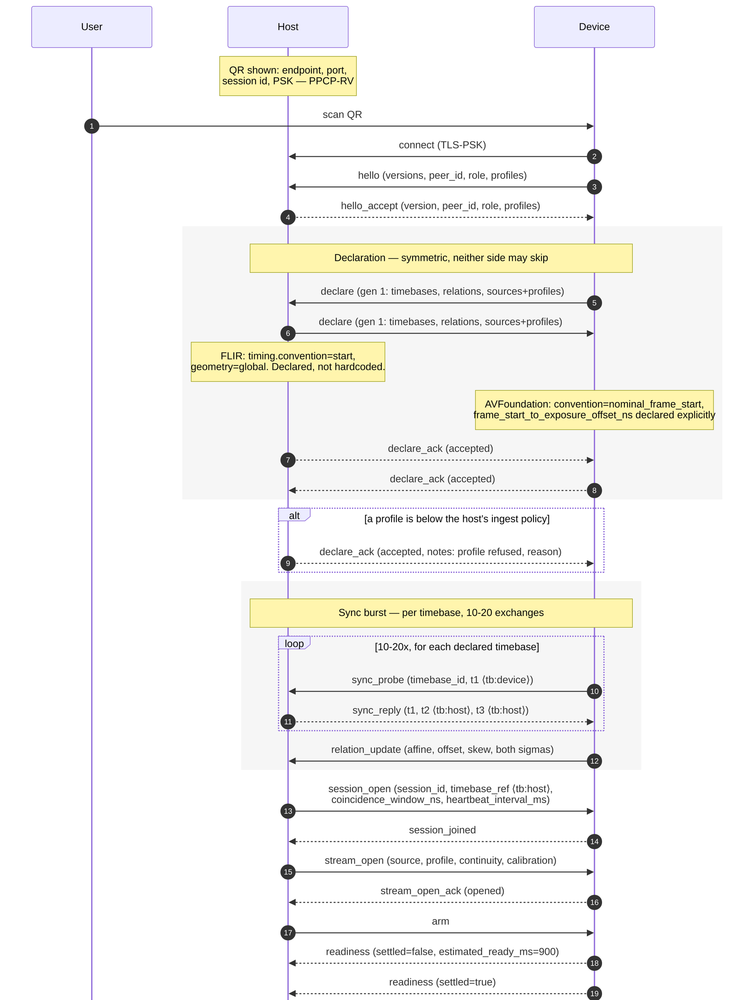
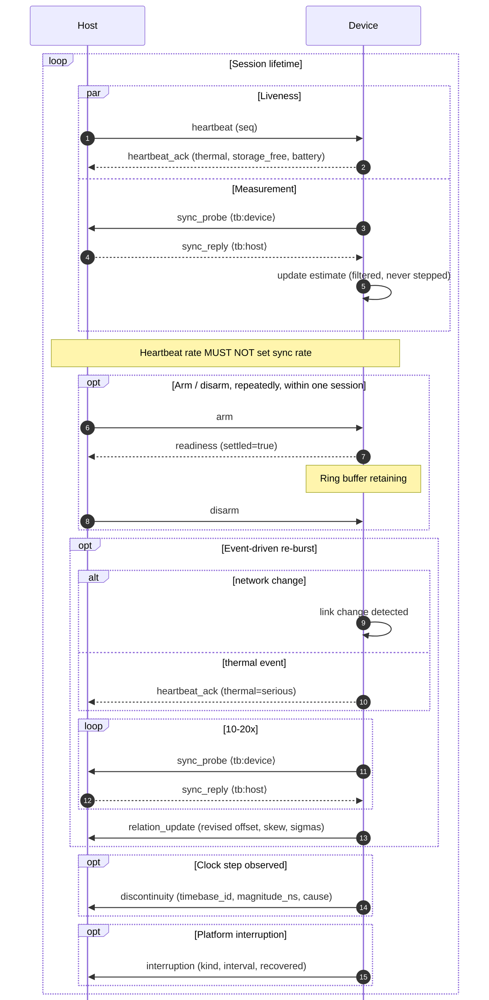
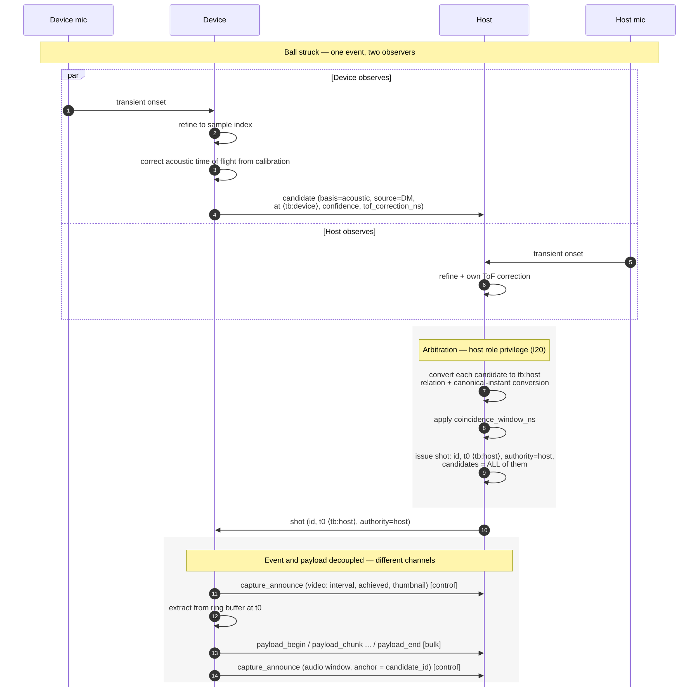
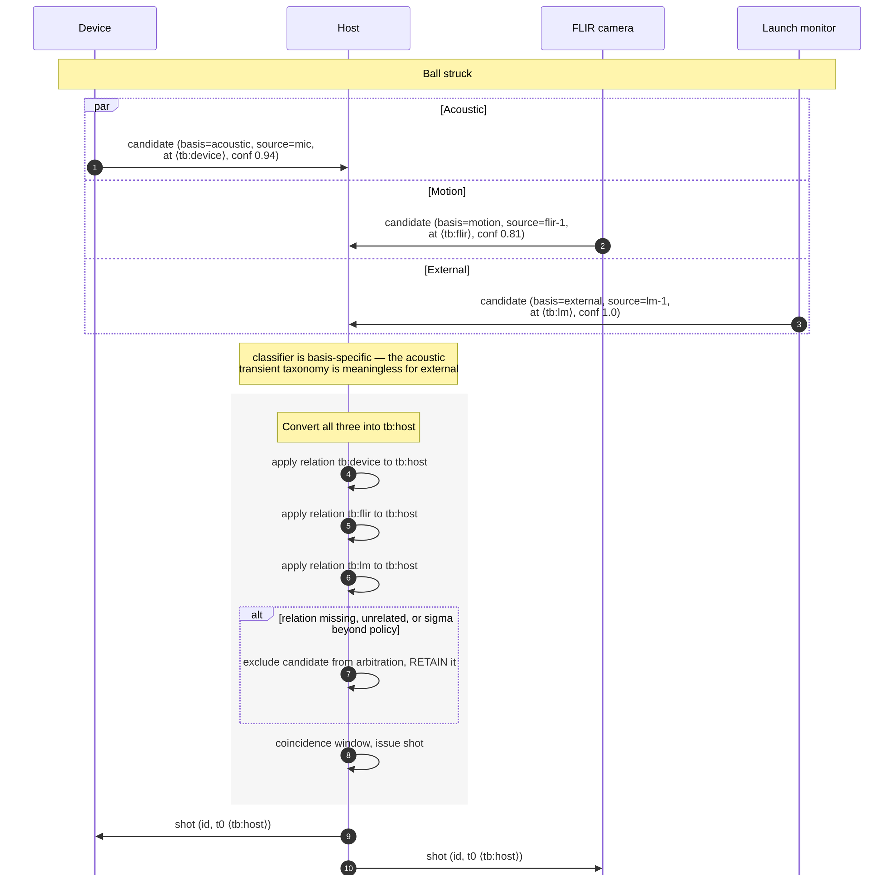
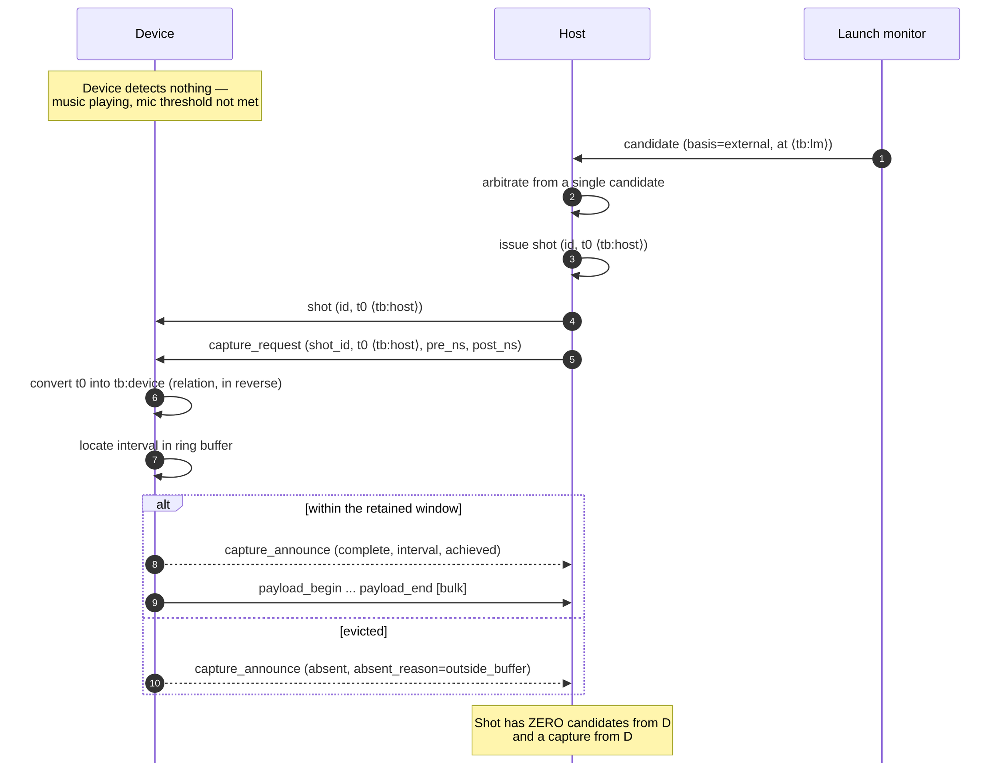
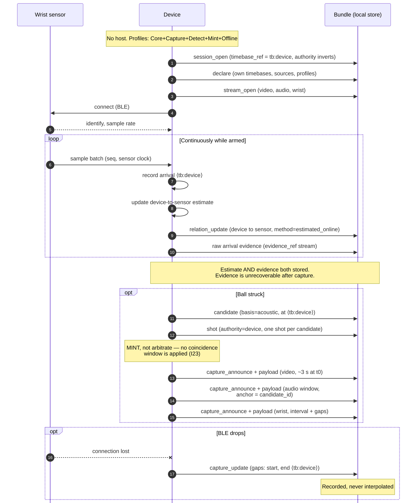
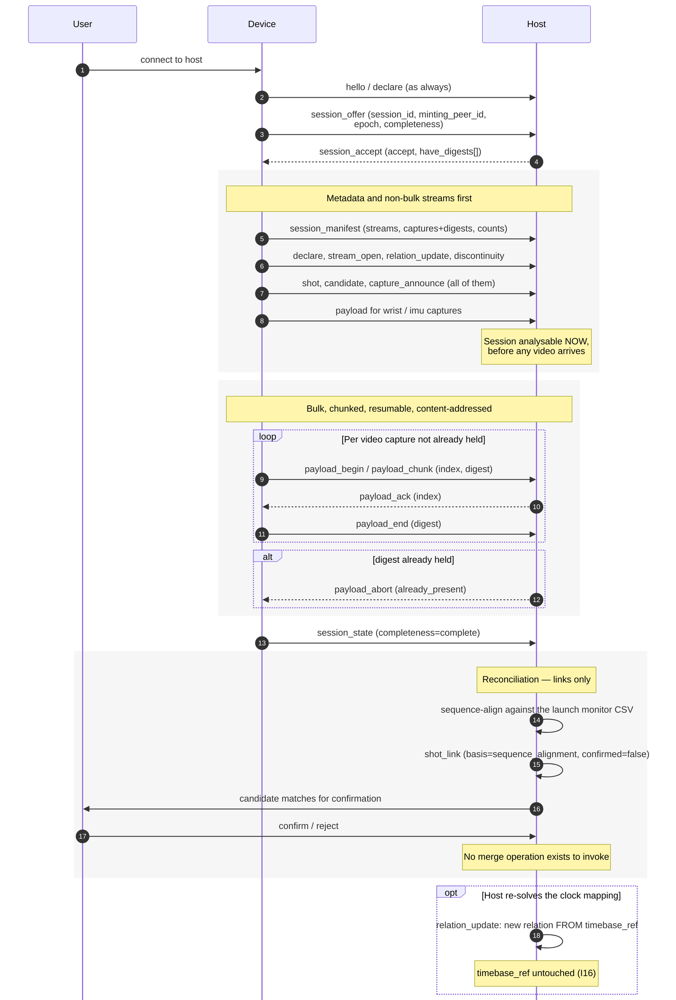
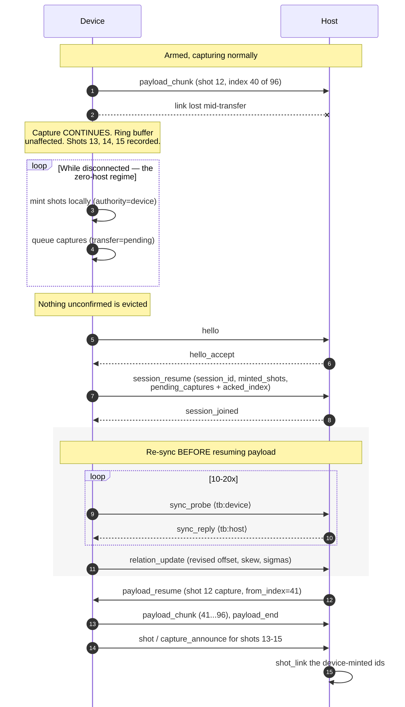
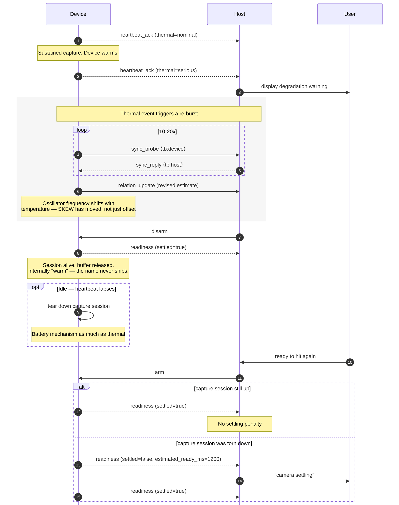

# PPCP — Message Catalogue

**Normative message set, channel semantics and error codes.**

| | |
|---|---|
| Document | `PPCP-MSG` |
| Version | **1.0, Draft 1** |
| Status | **Draft — for approval to implement** |
| Date | 22 August 2026 |
| Depends on | [`PPCP-CORE`](ppcp-core.md) for the entity model, [`PPCP-ENC`](ppcp-encoding.md) for framing and encoding |
| Supersedes | `ppcp-protocol-overview.md` Part II. The message names in that document were explicitly provisional; **these are the names.** |

---

## 1. Scope and conventions

This document fixes the message set. Field semantics come from [`PPCP-CORE` §5](ppcp-core.md#5-data-model); this document states what is sent, by whom, on which channel, and what response is required.

BCP 14 keywords are used as in [`PPCP-CORE` §2.1](ppcp-core.md#21-requirement-keywords).

**Message classes.**

| Class | Semantics |
|---|---|
| **Request** | Expects exactly one response, correlated by `in_reply_to`. A peer MUST respond, with `error` if it cannot comply. |
| **Response** | Carries `in_reply_to`. Never itself requires a response. |
| **Event** | Unsolicited. No response. A receiver that does not implement the behaviour ignores it (I13, I24). |

**Origination.** The **Profile** column of each table names the profile a peer MUST have declared to *originate* that message. Every conformant peer parses every message regardless of profile (I24, [`PPCP-CORE` §2.2.2](ppcp-core.md#222-what-a-profile-confers)).

**Direction** is stated as a constraint, not a topology. `any → any` means the message is symmetric.

- **(1a) MUST** A peer that receives a well-formed message whose behaviour it does not implement respond `error` / `profile_not_supported` if the message is a request, and ignore it if the message is an event.
- **(1b) MUST NOT** A peer close the transport in response to an unknown message type, an unknown field, or an unimplemented behaviour.

---

## 2. Channels

[`PPCP-CORE` §3](ppcp-core.md#3-transport-contract) requires at least two independently flow-controlled channels.

| Channel | Id | Carries | Rule |
|---|---|---|---|
| **Control** | 0 | Every message in [§3](#3-connection-and-declaration)–[§9](#9-offline-export-and-reconciliation) except the `payload_*` family | Small, immediate, never blocked by bulk |
| **Bulk** | 1..n | The `payload_*` family only | May lag, queue, resume, or never complete within the session |

- **(2a) MUST NOT** A `payload_chunk` be sent on the control channel.
- **(2b) MUST NOT** Any control message be sent on a bulk channel.
- **(2c) MUST** `payload_ack` is sent on the same bulk channel as the chunks it acknowledges, so acknowledgement backpressure does not couple to control latency.
- **(2d) MAY** An implementation open more than one bulk channel. Channel assignment for a given Capture is fixed by its `payload_begin` and does not change.

The event/payload split is the reason the two channels exist: a shot event must reach the host immediately so it can correlate and display, while a 25 MB capture is permitted to lag arbitrarily. A single stream carrying both makes the second shot's event wait behind the first shot's video.

---

## 3. Connection and declaration

| Message | Class | Direction | Channel | Profile |
|---|---|---|---|---|
| `hello` | Request | initiator → responder | control | — |
| `hello_accept` | Response | responder → initiator | control | — |
| `declare` | Request | any → any | control | Core |
| `declare_ack` | Response | any → any | control | Core |
| `relation_update` | Event | any → any | control | Core |
| `calibration_update` | Event | owner → any | control | Capture |
| `discontinuity` | Event | any → any | control | Core |

### 3.1 `hello`

```
hello {
  versions        [string]      supported wire versions, e.g. ["1.0"]
  peer_id         Id
  role            host | capture | observer
  profiles        [Kind]
  extensions      [Kind]
  product         { vendor, model, version }      optional, informational
}
```

- **(3.1a) MUST** `hello` is the first message the initiator sends on the control channel.
- **(3.1b) MUST** `versions` is ordered most-preferred first and contains at least one entry.

### 3.2 `hello_accept`

```
hello_accept {
  version         string        the single selected wire version
  peer_id         Id
  role            host | capture | observer
  profiles        [Kind]
  extensions      [Kind]        the intersection the responder will honour
  product         { ... }       optional
}
```

- **(3.2a) MUST** The responder selects the highest MINOR it supports within the highest MAJOR common to both. With no common MAJOR it responds `error` / `unsupported_version` and closes.
- **(3.2b) MUST** Both peers use the selected version for every subsequent message.
- **(3.2c) MUST** A responder that receives `role: host` while it is itself `host` responds `error` / `role_conflict` (I20).

### 3.3 `declare`

The symmetric declaration. **Both peers send it; neither may skip it.**

```
declare {
  generation      uint          monotonically increasing per peer, starting at 1
  peer            Peer          without `sources`, which follow separately below
  timebases       [Timebase]
  relations       [TimebaseRelation]
  sources         [Source]      each with its `profiles` and optional `calibration`
}
```

- **(3.3a) MUST** `declare` is a **complete snapshot**, not a delta. A later `declare` with a higher `generation` wholly replaces the previous one.
- **(3.3b) MUST** Every `timebase_id` referenced by any Source appears in `timebases`.
- **(3.3c) MUST** A peer sends `declare` before it originates any message referencing a Source, Stream or Candidate.
- **(3.3d) MUST** A host declares its own Sources with the same structure a capture peer uses, including `timing`, `geometry` and `intrinsics` on every profile (I19). **A host owning no Sources sends `declare` with an empty `sources` list** — it does not skip the message.
- **(3.3e) MUST NOT** A peer that has declared `sources` re-declare with a changed Source while a Stream referencing that Source is open. It closes the Stream first (I5).

3.3d is the wire-level form of symmetric declaration. Omitting it works for a single-vendor pairing and breaks any third-party host, because the conversion of [`PPCP-CORE` §6.1](ppcp-core.md#61-canonical-instant) can only be applied if both conventions are on the wire.

### 3.4 `declare_ack`

```
declare_ack {
  generation      uint          the generation being acknowledged
  verdict         accepted | rejected
  reason          Kind          required when rejected
  notes           [ { source_id, profile_id, verdict, reason } ]   optional, per-profile
}
```

- **(3.4a) MUST** A rejection carries a machine-readable `reason` and does **not** close the connection.
- **(3.4b) MUST NOT** Any threshold that drives a rejection appear in this specification. Whether 60 fps, a given resolution or a given noise figure is acceptable is the rejecting peer's own ingest policy (I14).
- **(3.4c) MAY** A peer reject individual profiles in `notes` while accepting the declaration as a whole. A profile rejected in `notes` MUST NOT be activated by a later `stream_open`.

### 3.5 `relation_update`

```
relation_update {
  relations       [TimebaseRelation]      replaces any existing relation with the same (from, to)
}
```

- **(3.5a) MUST** Sent after each synchronisation burst and whenever an estimate is revised ([`PPCP-CORE` §6.3](ppcp-core.md#63-clock-synchronisation)).
- **(3.5b) MUST** One relation per timebase pair the peer has measured; relations are never composed (I18).
- **(3.5c) MUST** `affine` relations carry both sigmas (I3).

### 3.6 `calibration_update`

```
calibration_update {
  calibration     Calibration
}
```

- **(3.6a) MUST** A calibration change closes every open Stream referencing that Source and requires a new `stream_open` (I5). The sender closes the affected Streams; the update does not do so implicitly.

### 3.7 `discontinuity`

```
discontinuity {
  discontinuity   ClockDiscontinuity
}
```

- **(3.7a) MUST** Emitted whenever a step is observed in one of the peer's declared timebases, whether or not `epoch_stable` predicted it.

---

## 4. Session control

| Message | Class | Direction | Channel | Profile |
|---|---|---|---|---|
| `session_open` | Request | host → peer | control | Core |
| `session_joined` | Response | peer → host | control | Core |
| `session_resume` | Request | peer → host | control | Live |
| `session_state` | Event | any → any | control | Core |
| `context_change` | Event | any → any | control | Core |
| `session_close` | Event | any → any | control | Core |

### 4.1 `session_open`

```
session_open {
  session_id              Id
  timebase_ref            Id            MUST be a timebase declared by the sender
  epoch                   { wall_utc_ns, at: Instant }    optional, label only
  coincidence_window_ns   Duration      default 50000000
  heartbeat_interval_ms   uint          default 1000
}
```

- **(4.1a) MUST** `timebase_ref` is immutable for the life of the Session (I16). A second `session_open` for the same `session_id` with a different `timebase_ref` is an error.
- **(4.1b) MUST** In a session with no host, the capturing peer performs the equivalent locally and **records a `session_open` frame in the bundle** with its own timebase as `timebase_ref`. The bundle is the same message stream either way.

### 4.2 `session_joined`

```
session_joined { session_id, peer_id, verdict: joined | refused, reason }
```

### 4.3 `session_resume`

```
session_resume {
  session_id
  peer_id
  minted_shots      [Id]        shots minted while the link was down
  pending_captures  [ { capture_id, digest, bytes, acked_index } ]
}
```

- **(4.3a) MUST** A peer reconnecting to a session it was previously joined to sends `session_resume` rather than `session_open`.
- **(4.3b) MUST** A synchronisation burst runs **before** any queued payload resumes ([`PPCP-CORE` §6.3c](ppcp-core.md#63-clock-synchronisation)). The relation drifted while the link was down — at 20 ppm, about 1.2 ms per minute.
- **(4.3c) MUST** Shots minted during the outage are reconciled through `shot_link`, exactly as an offline session's would be. They are not renumbered and their `authority` stays `device` (I7, I9).

### 4.4 `session_state`, `context_change`, `session_close`

```
session_state  { session_id, state: open | closed, completeness: complete | partial | unknown }
context_change { context: ContextChange }
session_close  { session_id, reason: Kind }
```

- **(4.4a) MUST** `completeness` is asserted by the peer that owns the data, never inferred by the receiver from what has arrived (I10).

---

## 5. Streams and capture control

| Message | Class | Direction | Channel | Profile |
|---|---|---|---|---|
| `stream_open` | Request | any → owner | control | Capture |
| `stream_open_ack` | Response | owner → any | control | Capture |
| `stream_close` | Event | owner → any | control | Capture |
| `arm` | Request | host → capture peer | control | Live |
| `disarm` | Request | host → capture peer | control | Live |
| `readiness` | Event | capture peer → any | control | Capture |
| `interruption` | Event | capture peer → any | control | Capture |
| `heartbeat` | Request | host → peer | control | Live |
| `heartbeat_ack` | Response | peer → host | control | Live |

### 5.1 `stream_open` / `stream_open_ack` / `stream_close`

```
stream_open      { stream: Stream }
stream_open_ack  { stream_id, verdict: opened | refused, reason, opened_at: Instant }
stream_close     { stream_id, closed_at: Instant, reason: Kind }
```

- **(5.1a) MUST** The Stream fixes `source_id`, `profile_id`, `timebase_id`, `calibration_id` and `continuity` for its lifetime (I5).
- **(5.1b) MUST** A change to any of those closes the Stream and opens another **within the same Session**. It does not end the Session.
- **(5.1c) MUST** In a zero-host session the capturing peer originates `stream_open` for its own Streams and records it in the bundle.

### 5.2 `arm` / `disarm` / `readiness`

```
arm        { stream_ids: [Id] }      empty list means every open capture Stream
disarm     { stream_ids: [Id] }
readiness  { readiness: Readiness, stream_ids: [Id] }
```

- **(5.2a) MUST** A capture peer emits `readiness` in response to `arm`, and again whenever `settled` changes.
- **(5.2b) MUST NOT** A device state-machine name cross the wire ([`PPCP-CORE` §5.15](ppcp-core.md#515-readiness)).
- **(5.2c) MUST** Arm and disarm cycle within one open session. Rebuilding the capture session on every arm is not required by the protocol and defeats the purpose of the readiness measurement.

### 5.3 `interruption`

```
interruption { kind: Kind, interval: Interval, recovered: bool, stream_ids: [Id] }
```

- **(5.3a) MUST** A platform interruption that costs capture — a call, an audio session interruption, backgrounding — is reported with the interval it covered. The gap it produced is additionally recorded on the affected Captures (I11).

### 5.4 `heartbeat` / `heartbeat_ack`

```
heartbeat      { seq: uint }
heartbeat_ack  { seq: uint,
                 thermal: ThermalLevel, vendor_thermal_label: string (optional),
                 storage_free_bytes: uint64, battery_pct: uint (optional), charging: bool (optional) }
```

- **(5.4a) MUST** The heartbeat rate does **not** set the synchronisation rate ([`PPCP-CORE` §6.3d](ppcp-core.md#63-clock-synchronisation)). Liveness and measurement are separate concerns sharing a channel.
- **(5.4b) MUST** Thermal state is reported here as a first-class field, so a host can report degradation rather than silently accepting worse data.
- **(5.4c) MUST** A peer treats the link as lost after three consecutive missed intervals.

---

## 6. Clock synchronisation

| Message | Class | Direction | Channel | Profile |
|---|---|---|---|---|
| `sync_probe` | Request | any → any | control | Live |
| `sync_reply` | Response | any → any | control | Live |
| `sync_residual` | Event | any → any | control | Live |

### 6.1 `sync_probe` / `sync_reply`

```
sync_probe { probe_seq: uint, timebase_id: Id, t1: Instant }
sync_reply { probe_seq: uint, t1: Instant, t2: Instant, t3: Instant }
```

Four timestamps: `t1` the probe's send instant in the prober's timebase; `t2` and `t3` the receive and send instants in the responder's timebase; `t4`, the reply's arrival, is recorded locally by the prober and never transmitted.

- **(6.1a) MUST** `t1` in `sync_reply` echoes the probe's `t1` unmodified, including its `tb`.
- **(6.1b) MUST** `t2` and `t3` are in the **same** responder timebase, and that timebase is one the responder declared.
- **(6.1c) MUST** `t2` is taken as close to reception as the implementation allows, and `t3` as close to transmission. A responder that cannot distinguish them sets `t3 == t2` and, by doing so, declares that the residence time is included in the measurement rather than removed from it.
- **(6.1d) MUST** A multi-timebase peer runs a separate probe sequence per timebase, setting `timebase_id` accordingly, and declares each relation directly (I21, I18).
- **(6.1e) MUST** A burst is 10–20 exchanges, performed on connect, after a network change and after a thermal event.
- **(6.1f) MUST** The resulting estimate is published in a `relation_update` and is filtered, never stepped.

The estimator is not mandated. Minimum-RTT filtering is RECOMMENDED because it estimates offset from the tightness of the latency distribution's left tail, which is what makes a USB tunnel converge faster than congested 2.4 GHz WiFi. What is mandated is that offset **and** rate are estimated and that both sigmas are declared.

### 6.2 `sync_residual`

```
sync_residual { shot_id: Id, timebase_id: Id, residual_ns: int64, basis: Kind }
```

- **(6.2a) SHOULD** A peer with an acoustic fiducial reports the per-shot residual between that fiducial and its network clock estimate. Accumulated over a session this also resolves the acoustic time-of-flight distance as a free parameter, which is why it is nearly free to compute.

---

## 7. Detection and shots

| Message | Class | Direction | Channel | Profile |
|---|---|---|---|---|
| `candidate` | Event | any → any | control | Detect |
| `shot` | Event | issuer → any | control | Mint (device) / Arbitrate (host) |
| `capture_request` | Request | any → owner | control | Arbitrate |

### 7.1 `candidate`

```
candidate { candidate: Candidate }
```

- **(7.1a) MUST** `Candidate.source_id` names a Source the sender declared, on a declared Timebase (I26).
- **(7.1b) MUST** `Candidate.at` is emitted **after** acoustic time-of-flight correction where the basis is `acoustic`, with the correction reported in `tof_correction_ns`.
- **(7.1c) MUST NOT** A record with no peer, no timebase and no clock relation — a filesystem-imported launch monitor CSV being the case that exists today — be sent as a `candidate`. It is reconciled by `shot_link` ([§9.3](#93-shot_link)) and never enters arbitration ([`PPCP-CORE` §8.1b](ppcp-core.md#81-nomination)).
- **(7.1d) MUST** A peer emits `candidate` for a nomination it also mints or that is later excluded. Losers are sent, not withheld (I8).

### 7.2 `shot`

```
shot { shot: Shot }
```

- **(7.2a) MUST** A host issuing a Shot from several peers' Candidates sets `authority: host` and `t0` in `Session.timebase_ref`, and sends `shot` to every peer in the Session.
- **(7.2b) MUST** A peer minting a Shot from its own Candidate sets `authority: device` (Mint profile). In a zero-host session **one Candidate produces exactly one Shot and no coincidence window is applied** (I23).
- **(7.2c) MUST NOT** A second `shot` for the same `shot.id` carry a different `t0` (I7). A late Candidate is attached by re-sending `shot` with an extended `candidates` list and the **unchanged** `t0`.

### 7.3 `capture_request`

```
capture_request { shot_id: Id, t0: Instant, stream_ids: [Id], pre_ns: Duration, post_ns: Duration }
```

- **(7.3a) MUST** A capture peer serves a `capture_request` for a `t0` it never nominated, converting `t0` into its own timebase using the declared relations and the canonical-instant conversion.
- **(7.3b) MUST** Where the interval is no longer retained, the peer answers with `capture_announce` carrying `completeness: absent` and `absent_reason: outside_buffer`. It does not answer with `error`: an absent capture is a result, not a failure (I10).

A Shot may therefore have zero Candidates from a peer and a Capture from that same peer. This is why `Shot.candidates` is non-empty per Session rather than per peer.

---

## 8. Captures and bulk transfer

| Message | Class | Direction | Channel | Profile |
|---|---|---|---|---|
| `capture_announce` | Event | owner → any | control | Capture |
| `capture_update` | Event | owner → any | control | Capture |
| `payload_begin` | Event | sender → receiver | bulk | Capture |
| `payload_chunk` | Event | sender → receiver | bulk | Capture |
| `payload_ack` | Event | receiver → sender | bulk | Capture |
| `payload_end` | Event | sender → receiver | bulk | Capture |
| `payload_abort` | Event | either | bulk | Capture |
| `payload_resume` | Request | receiver → sender | bulk | Capture |

### 8.1 `capture_announce`

The small, immediate message. It goes on the **control** channel and MUST NOT wait for payload.

```
capture_announce {
  capture     Capture               metadata only: anchor, interval, completeness, gaps, achieved, digest, bytes
  thumbnail   { format, bytes }     optional, MUST be <= 65536 bytes
}
```

- **(8.1a) MUST** `capture_announce` is sent as soon as the Capture's metadata is known, independently of whether its payload has begun transferring.
- **(8.1b) MUST** `Capture.achieved` carries the per-frame exposure durations for camera streams. Without them the canonical-instant conversion is impossible and the receiver's own bias estimate will absorb the error (I17).
- **(8.1c) MUST** A Capture anchored to a Candidate sets `anchor: { candidate_id }`; one anchored to a Shot sets `anchor: { shot_id }`. Exactly one (I27).
- **(8.1d) MUST NOT** A thumbnail exceed 64 KiB. Larger previews are Captures with their own payload.

### 8.2 `capture_update`

```
capture_update { capture_id, completeness, transfer, gaps, digest }
```

- **(8.2a) MUST** `completeness` and `transfer` are updated independently. `complete` + `pending` and `partial` + `present` are both normal.

### 8.3 The `payload_*` family

```
payload_begin  { capture_id, bytes: uint64, digest: Digest, chunk_bytes: uint32 }
payload_chunk  { capture_id, index: uint32, offset: uint64, data: bytes, digest: Digest }
payload_ack    { capture_id, index: uint32 }
payload_end    { capture_id, digest: Digest }
payload_abort  { capture_id, reason: Kind }
payload_resume { capture_id, from_index: uint32 }
```

- **(8.3a) MUST** Chunks for one Capture are sent in ascending `index` on one bulk channel.
- **(8.3b) MUST** `payload_chunk.digest` covers `data` only; `payload_begin.digest` and `payload_end.digest` cover the whole payload and MUST be equal.
- **(8.3c) MUST** A receiver that already holds a payload with the announced digest answers `payload_abort` / `already_present` rather than receiving it again. Re-import is a no-op, never a duplicate — users connect twice.
- **(8.3d) MUST** Resumption restarts from the chunk after the last acknowledged index, not from the beginning.
- **(8.3e) MUST NOT** A receiver treat the absence of payload as `completeness: absent`. Completeness is asserted by the owner (I10).
- **(8.3f) SHOULD** `chunk_bytes` is 262144 (256 KiB). It MUST NOT exceed 4 MiB.

---

## 9. Offline export and reconciliation

| Message | Class | Direction | Channel | Profile |
|---|---|---|---|---|
| `session_offer` | Request | exporter → importer | control | Offline |
| `session_accept` | Response | importer → exporter | control | Offline |
| `session_manifest` | Event | exporter → importer | control | Offline |
| `shot_link` | Event | importer → any | control | Offline |
| `session_link` | Event | importer → any | control | Offline |

### 9.1 `session_offer` / `session_accept`

```
session_offer  { session_id, minting_peer_id, epoch, completeness, bytes_estimate }
session_accept { session_id, verdict: accept | already_held | refuse, reason,
                 have_digests: [Digest] }
```

- **(9.1a) MUST** `have_digests` lets the exporter skip payloads the importer already holds. Session identity is `session_id` plus `minting_peer_id`; Capture identity is `Capture.digest`.

### 9.2 `session_manifest`

```
session_manifest { session_id, streams: [Id], captures: [ { capture_id, digest, bytes, stream_id } ],
                   completeness, counts: { shots, candidates, captures } }
```

- **(9.2a) MUST** In a bundle, `session_manifest` appears before any `payload_*` frame, so an importer can validate and commit before bulk data arrives and an interrupted transfer still yields an analysable session.

### 9.3 `shot_link`

```
shot_link { link: ShotLink }
```

- **(9.3a) MUST NOT** An implementation provide any operation that merges Shots. Reconciliation produces links; nothing is rewritten (I9).
- **(9.3b) MUST** A link is presented for confirmation before `confirmed: true` is set.
- **(9.3c) MUST** A filesystem-imported external record — the launch monitor case — is reconciled here, with `basis: sequence_alignment` or `manual`, and never as a Candidate.

### 9.4 `session_link`

```
session_link { link: SessionLink }
```

- **(9.4a) MUST NOT** A `session_link` alter `timebase_ref`, any Shot or any Capture in either Session (I25).
- **(9.4b)** Support is OPTIONAL at v1 and the type is provisional ([`PPCP-CORE` Annex B2](ppcp-core.md#annex-b--open-issues)).

---

## 10. Errors

```
error { code: Kind, message: string, in_reply_to: uint (optional), detail: map (optional) }
```

- **(10a) MUST** `error` is a response where it answers a request, and an event where it does not.
- **(10b) MUST NOT** Sending or receiving an `error` close the transport, except for the codes marked *fatal* below.

| Code | Fatal | Meaning |
|---|---|---|
| `unsupported_version` | yes | No common wire MAJOR. |
| `role_conflict` | yes | A second peer declared `role: host` (I20). |
| `malformed` | no | Frame or message failed to decode, or a mandatory field was absent. |
| `profile_not_supported` | no | Understood, but the behaviour is not implemented by this peer (I24). |
| `policy_reject` | no | Refused under the receiver's own ingest policy. Carries a `detail` reason. |
| `unknown_session` | no | `session_id` not known to this peer. |
| `unknown_stream` | no | `stream_id` not known or already closed. |
| `unknown_capture` | no | `capture_id` not known. |
| `not_declared` | no | A message referenced a Source, Timebase or Calibration that was never declared. |
| `relation_missing` | no | Conversion required a relation that does not exist (`unrelated` or absent). |
| `relation_uncertain` | no | A relation exists but its sigma exceeds the receiver's policy. |
| `not_armed` | no | Capture requested while disarmed. |
| `outside_buffer` | no | *Not an error for captures* — see 7.3b. Reserved for requests that are not capture requests. |
| `storage_full` | no | |
| `already_present` | no | Payload with this digest is already held (8.3c). |
| `resource_exhausted` | no | Transient; the sender may retry. |
| `internal` | no | |

- **(10c) MUST** `relation_missing` and `relation_uncertain` are reported rather than worked around. A peer MUST NOT substitute a zero offset for a relation it does not have; the candidate or sample is excluded and retained instead (I8, 5.4b of `PPCP-CORE`).

---

## 11. Message index

Forty-two messages. `R` request, `S` response, `E` event.

| Message | | Channel | Profile to originate | Section |
|---|---|---|---|---|
| `hello` | R | control | — | [3.1](#31-hello) |
| `hello_accept` | S | control | — | [3.2](#32-hello_accept) |
| `declare` | R | control | Core | [3.3](#33-declare) |
| `declare_ack` | S | control | Core | [3.4](#34-declare_ack) |
| `relation_update` | E | control | Core | [3.5](#35-relation_update) |
| `calibration_update` | E | control | Capture | [3.6](#36-calibration_update) |
| `discontinuity` | E | control | Core | [3.7](#37-discontinuity) |
| `session_open` | R | control | Core | [4.1](#41-session_open) |
| `session_joined` | S | control | Core | [4.2](#42-session_joined) |
| `session_resume` | R | control | Live | [4.3](#43-session_resume) |
| `session_state` | E | control | Core | [4.4](#44-session_state-context_change-session_close) |
| `context_change` | E | control | Core | [4.4](#44-session_state-context_change-session_close) |
| `session_close` | E | control | Core | [4.4](#44-session_state-context_change-session_close) |
| `stream_open` | R | control | Capture | [5.1](#51-stream_open--stream_open_ack--stream_close) |
| `stream_open_ack` | S | control | Capture | [5.1](#51-stream_open--stream_open_ack--stream_close) |
| `stream_close` | E | control | Capture | [5.1](#51-stream_open--stream_open_ack--stream_close) |
| `arm` | R | control | Live | [5.2](#52-arm--disarm--readiness) |
| `disarm` | R | control | Live | [5.2](#52-arm--disarm--readiness) |
| `readiness` | E | control | Capture | [5.2](#52-arm--disarm--readiness) |
| `interruption` | E | control | Capture | [5.3](#53-interruption) |
| `heartbeat` | R | control | Live | [5.4](#54-heartbeat--heartbeat_ack) |
| `heartbeat_ack` | S | control | Live | [5.4](#54-heartbeat--heartbeat_ack) |
| `sync_probe` | R | control | Live | [6.1](#61-sync_probe--sync_reply) |
| `sync_reply` | S | control | Live | [6.1](#61-sync_probe--sync_reply) |
| `sync_residual` | E | control | Live | [6.2](#62-sync_residual) |
| `candidate` | E | control | Detect | [7.1](#71-candidate) |
| `shot` | E | control | Mint / Arbitrate | [7.2](#72-shot) |
| `capture_request` | R | control | Arbitrate | [7.3](#73-capture_request) |
| `capture_announce` | E | control | Capture | [8.1](#81-capture_announce) |
| `capture_update` | E | control | Capture | [8.2](#82-capture_update) |
| `payload_begin` | E | **bulk** | Capture | [8.3](#83-the-payload_-family) |
| `payload_chunk` | E | **bulk** | Capture | [8.3](#83-the-payload_-family) |
| `payload_ack` | E | **bulk** | Capture | [8.3](#83-the-payload_-family) |
| `payload_end` | E | **bulk** | Capture | [8.3](#83-the-payload_-family) |
| `payload_abort` | E | **bulk** | Capture | [8.3](#83-the-payload_-family) |
| `payload_resume` | R | **bulk** | Capture | [8.3](#83-the-payload_-family) |
| `session_offer` | R | control | Offline | [9.1](#91-session_offer--session_accept) |
| `session_accept` | S | control | Offline | [9.1](#91-session_offer--session_accept) |
| `session_manifest` | E | control | Offline | [9.2](#92-session_manifest) |
| `shot_link` | E | control | Offline | [9.3](#93-shot_link) |
| `session_link` | E | control | Offline | [9.4](#94-session_link) |
| `error` | R/S/E | either | — | [10](#10-errors) |

---

# Annex A — Interaction sequences

*Non-normative. The message names here are the normative names of [§3](#3-connection-and-declaration)–[§10](#10-errors); where a diagram and the catalogue disagree, the catalogue wins.*

These nine sequences replace Part II of the protocol overview. They are retained because every fault found in the model so far was found by *using* it — tracing a flow and discovering the model could not express it. Sequences are how a model is tested.

**Conventions.** `⟨tb:x⟩` marks the timebase a value is expressed in; every timestamp shows one (I1). Dashed arrows are responses. **Both channels are drawn as one lifeline** — the control/bulk split of [§2](#2-channels) is invisible in a sequence diagram and is the single easiest requirement to miss.

| # | Sequence | Principally exercises |
|---|---|---|
| A.1 | Session establishment | symmetric declaration, capability, sync burst |
| A.2 | Steady state | heartbeat vs sync, arm/disarm cycling, discontinuity |
| A.3 | Shot with host present | arbitration, time of flight, event/payload split |
| A.4 | Shot with an external nominator | `basis`, three timebases, exclusion with retention |
| A.5 | Orphan capture request | serving a shot the peer never detected |
| A.6 | Offline capture | zero-host regime, Mint, device as time authority |
| A.7 | Offline export | bundle as file transport, reconciliation by link |
| A.8 | Degradation | capture degrades last, queue and resume |
| A.9 | Thermal lapse and re-arm | readiness as measurement |

---

## A.1 Session establishment

Both peers declare. The host is not a special case (I19, I20).



| Step | Reference | Note |
|---|---|---|
| 1–5 | REQ-DISC-2, REQ-AUTH-1, [§3.1](#31-hello) | QR is the primary pairing path, not a fallback. Its format is `PPCP-RV`, which does not yet exist. |
| 6 | I1, I4, [`CORE` §5.3](ppcp-core.md#53-timebase) | iOS camera and mic share `tb:hosttime`, so no relation is needed. Android `UNKNOWN` declares distinct ids, so a relation is structurally required. |
| 7 | **I19**, 3.3d | The host declares its own conventions. Omitting this works for one vendor and breaks every third-party host. |
| 9 | **I22** | `frame_start_to_exposure_offset_ns` is mandatory on this convention and declared even when zero. |
| 12 | I14, 3.4b | Frame-rate thresholds are host policy. The protocol carries the rejection, never the threshold. |
| 15–19 | **I3, I18, I21** | Per timebase, not per peer. Sigma is mandatory on `affine`. Relations are never composed. |
| 20 | I16 | `timebase_ref` is fixed here and never changes. |
| 22 | I5 | The Stream fixes source, profile, timebase and calibration for its lifetime. |
| 25–26 | [`CORE` §5.15](ppcp-core.md#515-readiness) | Readiness is a measurement. `cold`/`warm`/`armed` never crosses the wire. |

---

## A.2 Steady state

Three concerns share the control channel and must not be conflated: **liveness** (heartbeat), **measurement** (sync), and **control** (arm/disarm).



| Step | Reference | Note |
|---|---|---|
| 2–3 | [§5.4](#54-heartbeat--heartbeat_ack) | Thermal is a first-class field so a host reports degradation rather than silently accepting worse data. |
| 4–6 | 6.1e, [`CORE` §6.3d](ppcp-core.md#63-clock-synchronisation) | Drawn as `par` deliberately. One exchange per heartbeat converges far too slowly on skew. |
| 6 | 6.1f | Filtered, never stepped. A stepped offset leaves a discontinuity in fused output that is very hard to diagnose later. |
| 7 | — | At 20 ppm a full 150 fps frame slips every ~5.5 minutes, so skew estimation is mandatory. |
| 9–12 | 5.2c | Armed-and-reviewing is the normal range state, so arm/disarm cycles *inside* the maintained connection. |
| 14–21 | 6.1e | Burst on network change and thermal event, then settle to maintenance cadence. Oscillator frequency shifts with temperature — the skew estimate goes stale, not just the offset. |
| 23 | **I15**, [`CORE` §6.4](ppcp-core.md#64-clock-discontinuity) | An observed step is a measurement, and the evidence that any wall-derived interval across it would be wrong. |
| 26 | 5.3a | The gap is reported here *and* recorded on the affected Captures. |

---

## A.3 Shot with host present

The two microphones are drawn as distinct Sources because their **calibrations differ** — and acoustic time of flight lives in the calibration.



| Step | Reference | Note |
|---|---|---|
| 2–3, 7 | REQ-MIC-2 | Onset refined to sample index within the buffer; buffer granularity is not good enough. |
| 4, 8 | [`CORE` §8.1d](ppcp-core.md#81-nomination) | 2.9 ms/m. A device 2 m out lags 5.8 ms — most of a frame at 150 fps. **Different mic, different constant**, which is why the two are separate Sources. |
| 5 | 7.1b | The correction is applied before `at`, and reported so the host can undo it. |
| 10 | **I17** | Conversion needs the relation **and** the canonical-instant conversion. Either alone gives a wrong answer. |
| 11 | 8.2c of `CORE` | The coincidence window is a declared Session parameter, not a constant. Default 50 ms. |
| 12 | **I8** | All candidates retained, winners and losers. Arbitration is a conclusion; candidates are the evidence. |
| 15 | 8.1a | Small and immediate on the **control** channel, so the host correlates and displays before any video arrives. |
| 17 | 8.3, T2 | Bulk channel — may lag, queue, resume, or never complete in-session. |
| 18 | **I27**, 5.12.1 of `CORE` | The audio window anchors to the **candidate**, so rejected candidates keep their evidence too. |

**Worth noticing.** `achieved` is not decoration. The conversion to canonical mid-exposure needs the profile's `timing` *and* that frame's exposure duration, and the latter exists only in `achieved`. A host that ignores it produces an exposure-dependent bias indistinguishable from clock error — which then corrupts its own bias estimator.

---

## A.4 Shot with an external nominator

Three nominators, three timebases, three bases. The launch monitor here is **connected as a peer** — the filesystem-imported case is A.7, and is deliberately a different path.



| Step | Reference | Note |
|---|---|---|
| 2–4 | REQ-SHOT-5 | Three `basis` values. A model with an acoustic-only Candidate could not express steps 3 or 4 at all. |
| 4 | **I26**, [`CORE` §8.1c](ppcp-core.md#81-nomination) | A *connected* launch monitor is a Source with a clock and a calibration, so `source_id` stays mandatory. |
| 7–9 | **I18** | Three relations, each measured directly. Never composed. |
| 10 | **I8**, 10c | A candidate whose relation is missing or too uncertain is excluded from arbitration and retained. Exclusion is a conclusion; the candidate remains evidence. A peer MUST NOT substitute a zero offset. |

---

## A.5 Orphan capture request

The host arbitrates a shot from evidence the device never saw, then asks for the clip anyway.



| Step | Reference | Note |
|---|---|---|
| 2–4 | **I6**, I20 | A Shot needs ≥1 Candidate *somewhere in the Session*, not one per peer. Only a host may arbitrate. |
| 6–8 | 7.3a | The device serves a clip for a `t0` it never detected. Conversion runs the relation in reverse. |
| 12 | **I10**, 7.3b | `absent` is asserted with a reason and answered as a `capture_announce`, **not** as an `error`. An absent capture is a result. |
| 13 | [`CORE` §5.13](ppcp-core.md#513-shot) | Candidates and Captures are independent collections on a Shot. Neither implies the other. |

---

## A.6 Offline capture — the zero-host regime

**No host exists.** The device is the session's time authority, it mints its own Shots, and **no arbitration occurs**. Every message shown is written to the bundle in the same encoding it would have on the wire.



| Step | Reference | Note |
|---|---|---|
| 2 | **I20**, 4.1b | At most one host, not exactly one. With none, `authority` is `device` and the device's timebase is canonical. |
| 10–13 | [`CORE` §9.1](ppcp-core.md#91-clock-authority-inverts) | The device estimates the sensor mapping live and continuously — the same machinery as network sync, pointed at BLE. |
| 13 | **9.1b** | Both the estimate **and** the raw evidence are stored. The evidence exists only at capture time; a device that defers reconciliation to import has destroyed what it needs. |
| 16 | **I23** | This is the invariant a studio-only implementation will never exercise. Applying a coincidence window here would collapse distinct candidates. |
| 18–20 | I12 | Any subset of streams is a valid session. Video-only sessions will exist for months before sensors arrive. |
| 24 | **I11** | Gaps are explicit and never spanned. Offline there is no host to notice a dropout. |

---

## A.7 Offline export and reconciliation

The bundle **is** a recorded PPCP message stream replayed through a file transport — not an import format.



| Step | Reference | Note |
|---|---|---|
| 3 | **I10** | Completeness is asserted session-level state, never inferred from what happens to have arrived. |
| 4, 17 | 8.3c, 9.1a | Content-addressed and idempotent. Re-import is a no-op; users connect twice. |
| 6–9 | 9.2a, 9b of `CORE` | Metadata first — not because video is slow, but so the host can validate and commit before bulk data, and an interrupted transfer still yields an analysable session. |
| 6–9 | 9a of `CORE` | **The same messages as the live path.** The host gains a file transport, not an importer — one parser, one schema, one conformance suite. |
| 20–23 | **I9**, 9.3c | The launch monitor CSV is reconciled here, as a `shot_link`. It is **not** a Candidate: it has no peer, no timebase and no clock relation. |
| 25–26 | **I16**, 8.5d of `CORE` | The host's better estimate is a **new relation from** the canonical timebase. Mutating `timebase_ref` would be the destructive rewrite reconciliation forbids. |

---

## A.8 Degradation — link loss mid-session

**Capture degrades last.** The link failing must not cost a single frame.



| Step | Reference | Note |
|---|---|---|
| 2–4 | 7.4d of `CORE` | Capture is non-recoverable; transfer is retryable. The link failing costs no frames. |
| 5–7 | 8.3d of `CORE` | The device falls into the zero-host regime for the duration and mints its own shot ids — which is the **Mint** profile, not Arbitrate. |
| 11–13 | 4.3 | `session_resume`, not `session_open`. The session did not end. |
| 15–19 | **4.3b** | Re-burst before resuming. The relation drifted while disconnected — at 20 ppm, ~1.2 ms per minute. |
| 20 | 8.3d | Resume from the chunk after the last acknowledged index, not from the start. |
| 22 | **I9** | Shots minted during the outage reconcile via `shot_link`, exactly as an offline session's would. They are not renumbered. |

---

## A.9 Thermal lapse and re-arm

Why a device keeps a warm state internally, and why what crosses the wire is a measurement instead.



| Step | Reference | Note |
|---|---|---|
| 3–4 | 5.4b | Thermal is a first-class protocol field so the host can tell the user the device is degrading, rather than silently producing worse data. |
| 6–10 | 6.1e | Thermal events trigger a re-burst because oscillator frequency shifts with temperature. The skew estimate is stale, not just the offset. |
| 11–13 | 5.2c | Disarm keeps the session running with the buffer released. |
| 17–23 | **5.2b**, [`CORE` §5.15](ppcp-core.md#515-readiness) | The host learns *settled* and *estimated time to ready*, never a state name. Those names are platform-shaped and their settling costs differ elsewhere. The measurement answers the host's actual question: will the next shot be usable? |
| 22 | — | The first shot after a cold re-arm is exactly the one not to lose. |
